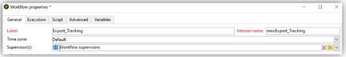

# Best practices voor workflows - configuratie en bewaking in Campaign Classic

In dit artikel worden enkele aanbevolen procedures beschreven voor configuratie en bewaking van workflows in Adobe Campaign Classic.

## Beschrijving {#description}

### <b>Omgeving</b>

- Adobe Campaign
- Adobe Campaign Classic

### <b>Probleem</b>

De meeste tijd maken workflows deel uit van de kernfuncties (ingebouwd of aangepast) van het platform. Daarom is het erg belangrijk om voorzichtig te zijn wanneer u ze configureert.

## Resolutie {#resolution}

### Algemene configuratie

#### Organisatie

Maak uw workflows, zoals importeren in tableXXX, in een aangepaste map.

Alleen als de algemene workflow het hele platform beïnvloedt (bijvoorbeeld reinigen), kunt u het programma dan in de ingebouwde <b>Technische werkstromen</b> map.

#### Werkstroomnaam

Zoals eerder uitgelegd, is het echt belangrijk om werkstromen eigennamen en etiketten te geven. Aangezien een exploitant niet altijd naar de documentatie zal verwijzen, vul het werkschema in <b>beschrijving</b> veld voor een overzicht van het uit te voeren proces.

Als de workflow deel uitmaakt van een proces waarbij meerdere workflows zijn betrokken, kunt u de optie Vrijheid gebruiken om expliciet te zijn wanneer u een label invoert. Het gebruik van nummers is een goede manier om de workflows te bestellen (met Label). Bijvoorbeeld:

- 001 - Invoer - Ontvangers van de invoer
- 002 - Invoer - Uitvoer
- 003 - Invoer - Gegevens over de verkoop bij invoer
- 010 - Exporteren - Leveringslogboeken exporteren
- 011 - Logbestanden voor bijhouden van export

#### Ernst

Vorm de strengheid van een werkschema in de werkschemaeigenschappen, in <b>Uitvoering</b> tab:

- Normaal
- Productie
- Kritiek

Het verstrekken van deze informatie wanneer het creëren van een werkschema zal helpen de strengheid van het gevormde proces begrijpen.

#### Logboeken

De JavaScript-methode `logInfo()` is een grote oplossing voor het zuiveren van een werkschema. Het is nuttig, maar het moet zorgvuldig worden gebruikt, vooral voor activiteiten die vaak in werking worden gesteld: het kan de logboeken overladen en beduidend de grootte van de logboeklijst verhogen.

Maar misschien hebt u ook meer nodig dan `logInfo()`. Er zijn twee aanvullende oplossingen beschikbaar om u te helpen.

<b>Behoud het resultaat van tussentijdse populaties tussen twee executies</b>

Deze optie is beschikbaar in de eigenschappen van de workflow. <b>Algemeen</b> kan zo nuttig zijn als gevaarlijk kan zijn. Zo voorkomt u dat Adobe Campaign de tijdelijke tabellen verwijdert die tussen twee uitvoeringen zijn gemaakt. Hoewel dit handig kan zijn voor ontwikkelomgevingen, is het gebruik ervan in productieomgevingen niet toegestaan en moet dit worden gecontroleerd. Het houden van tijdelijke lijsten zou in de grootte van het gegevensbestand kunnen resulteren die beduidend en uiteindelijk de groottegrens wordt bereikt. Bovendien zal het de back-up vertragen.

<b>Geen workflows</b> deze optie moet op elk moment bij de productie worden gecontroleerd.

<b><u>SQL-query&#39;s vastleggen in het journaal</u>:</b>

Beschikbaar in het dialoogvenster <b>Uitvoering</b> tabblad met workfloweigenschappen, worden alle SQL-query&#39;s die door het gereedschap worden gegenereerd, vanaf de verschillende activiteiten geregistreerd. Het is een goede manier om te zien wat er daadwerkelijk door het platform wordt uitgevoerd. Deze optie mag echter alleen tijdelijk tijdens de ontwikkeling worden gebruikt en niet tijdens de productie worden geactiveerd.

#### Bewaking

Alle geplande workflows die op productieomgevingen worden uitgevoerd, moeten worden gecontroleerd om te worden gewaarschuwd als er een fout optreedt.

Selecteer in de workfloweigenschappen een <b>supervisorgroep</b>, de standaard &quot;Workflowsupervisors&quot; of een aangepaste groep. Zorg ervoor dat ten minste één operator tot deze groep behoort, met een e-mailinstelling.

<b><u>Workflows niet gepauzeerd laten</u>:</b>

Als u een tijdelijke werkstroom creeert, zorg ervoor het correct zal kunnen voltooien en niet in een &quot;gepauzeerde&quot;staat blijven. Als het wordt gepauzeerd, zou het impliceren dat u de tijdelijke lijsten moet houden en zo de grootte van het gegevensbestand verhogen.

### Binnen de workflow

#### Naam activiteit

Tijdens het ontwikkelen van uw workflow hebben alle activiteiten een naam, net als alle Adobe Campaign-objecten. Terwijl de naam door het hulpmiddel wordt geproduceerd, adviseren wij u het met een expliciete naam anders te noemen wanneer het vormen van het. Het risico dat het later gebeurt, is dat het de werkstroom kan onderbreken met activiteiten die de naam van een andere voorgaande activiteit gebruiken. Het zou dus moeilijk zijn om de namen achteraf bij te werken.

De naam van de activiteit is te vinden in de <b>Geavanceerd</b> tab. Laat ze geen query, query1, query11, maar geef ze expliciete namen, zoals `querySubscribedRecipients`. Deze naam zal in het dagboek, en indien van toepassing in de SQL logboeken verschijnen, en dit zal helpen om het werkschema te zuiveren wanneer het vormen van het.

#### JavaScript binnen een activiteit

U kunt JavaScript toevoegen bij het initialiseren van een workflowactiviteit. Dit kan worden gedaan in een activiteit <b>Geavanceerd</b> tab. Om het spotting van het werkschema gemakkelijker te maken, adviseren wij gebruikend dubbele streepjes aan het begin en eind van het activiteitenetiket als volgt: *— Mijn label —*

#### Signaal

Meestal zult u niet weten waar het signaal vandaan komt. Om dit probleem te voorkomen, gebruikt u de <b>Opmerking</b> in het veld <b>Geavanceerd</b> tabblad van de signaalactiviteit om de verwachte oorsprong van een signaal voor deze activiteit te documenteren.

#### Workflow-update

Een productiewerkstroom mag niet rechtstreeks worden bijgewerkt. Tenzij het proces bestaat uit het maken van een campagne met sjabloonworkflows, moeten processen eerst zo mogelijk worden getest op een ontwikkelomgeving. Pas na deze validatie kan de workflow worden geïmplementeerd en op productie worden gestart.

Gearchiveerde workflows kunnen op ontwikkelings- of testplatforms worden bewaard, in een <b>Gearchiveerd</b> maar de productie moet zo schoon mogelijk blijven. Oude workflows moeten uit de productie worden verwijderd als ze inactief zijn.
