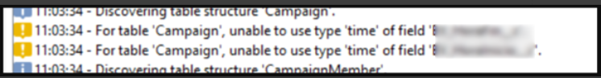

# [!DNL Salesforce] Wizard wijst geen tijdtekstvelden toe

## Beschrijving

Probleembeschrijving = De [!DNL Salesforce] Wizard wijst geen velden van het type &#39;Tijd&#39; toe

## Resolutie

Probleemoplossing =

Zoals in onze bespreking met het Team van de Techniek, schijnt het wij geen &quot;tijd&quot;gegevenstype in Adobe Campaign Classic steunen.

U kunt naar sfdcConnector.js voor het controleren op datatypes verwijzen die Adobe Campaign Classic steunt.

Het is beschikbaar in Beleid - Configuratie - JS Codes

Ons Engineering Team heeft aanbevolen &#39;datetime&#39; te gebruiken.
