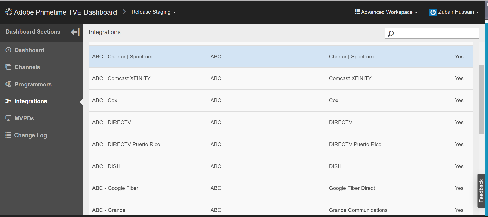

# Hoe kan ik bevestigen of SSO voor mijn Kanaal wordt toegelaten of onbruikbaar gemaakt?

## Beschrijving

 Omgeving  
Periodieke ophaling, Prequente productie, ophaling en productie van vrijgave

## Resolutie

 SSO wordt toegelaten door gebrek voor alle integratie, echter, wordt het gevormd zodat SSO gehandicapt is.  U kunt controleren of SSO is uitgeschakeld door de integratie in het TVE-dashboard te bekijken.  De volgende attributen worden geplaatst aan JA, als SSO voor een integratie Kanaal - MVPD is onbruikbaar gemaakt:  
1. Auth/Aggregator — JA
2. Passieve authN inschakelen — JA

Als de instellingen niet zijn ingesteld of op NO zijn ingesteld, is SSO beschikbaar voor de integratie. Als u deze instellingen wijzigt in NO, kunt u ook SSO inschakelen.  U vindt deze instellingen door naar de specifieke integratie te gaan (Zorg ervoor dat de werkruimte Geavanceerd is geselecteerd).
1. Klik op uw specifieke integratie in het TVE-dashboard.
2. Selecteer het tabblad Algemene instellingen en schuif omlaag.
3. Klik op de knop Aanvullende eigenschap tonen om de waarde van Auth/Aggregator en Enable Passive AuthN weer te geven. 
