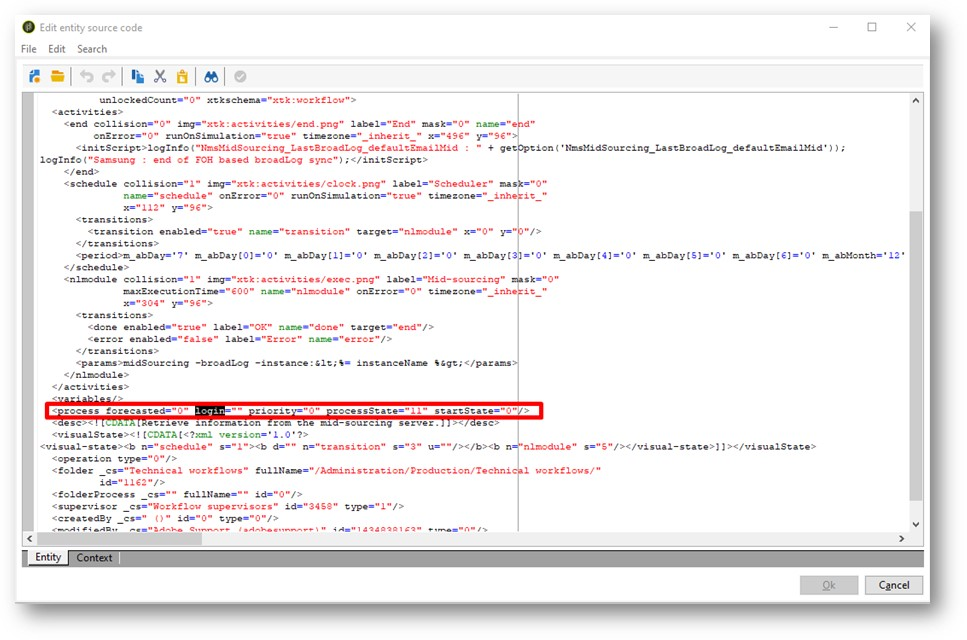

# ACC || Voorkomen dat de WF wordt uitgevoerd

## Beschrijving

<b>Omgeving</b>
- Campaign Classic
- Campaign

<b>Problemen/symptomen</b>
Een cliëntwerkschema dat rapporten produceert produceert produceert geen rapport meer omdat een gebruiker die het bedrijf heeft laten onbruikbaar worden gemaakt. Bij het uitschakelen van de gebruiker van de campagneclassiek in toegangsbeheer, toont de workflow nog steeds een fout. Als de gebruiker is ingeschakeld, kan hij of zij de workflow gebruiken. Waarom stopte het zodra de gebruiker gehandicapt is en hoe te om het te houden werkend zodra het onbruikbaar maken van de gebruiker?

## Resolutie

Vraag met screenshot —

Een cliëntwerkschema dat rapporten produceert produceert produceert geen rapport meer omdat een gebruiker die het bedrijf heeft laten onbruikbaar worden gemaakt. Bij het uitschakelen van de gebruiker van de campagneclassiek in toegangsbeheer, toont de workflow nog steeds een fout. Als de gebruiker is ingeschakeld, kan hij of zij de workflow gebruiken. Waarom stopte het zodra de gebruiker gehandicapt is en hoe te om het te houden werkend zodra de gebruiker gehandicapt is?

Is er een andere manier om de gebruiker te verwijderen en de client in staat te stellen de workflow te gebruiken?

Oplossing --

Wanneer deze fout optreedt,

1. Open de workflow.
2. Klik op XML-bron bewerken...
3. Zoeken naar trefwoord <b>login=&quot;</b>
4. U zult een element in XML zoals hier getoond vinden
5. In uw geval heeft de aanmelding een bepaalde waarde<b>.</b>
6. Leeg het aanmeldingskenmerk om dit te maken <b>login=&quot;&quot;</b>
7. Klikken op <b>OK </b>om het pop-upvenster te sluiten.
8. Sla de workflow op.
9. Start de workflow opnieuw. Als de workflow deel uitmaakt van een campagne (wat in 99% van de gevallen het geval zal zijn), vraagt u de relevante gebruiker aan de kant van de klant om deze workflow opnieuw te starten met zijn id, vanuit de campagne en niet vanuit de werkstroommap.
10. Het moet worden vastgesteld.
11. Later kunt u naar de map Workflows View gaan en zoeken <b>*mdata contains login=&quot;username&quot;</b>* om te zoeken naar andere werkstromen die gevolgen kunnen hebben.
12. Herhaal de bovenstaande stappen voor elke stap.

Hopelijk helpt dit.
