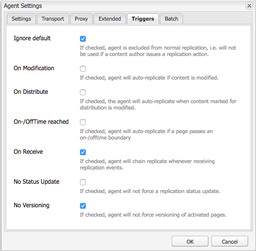
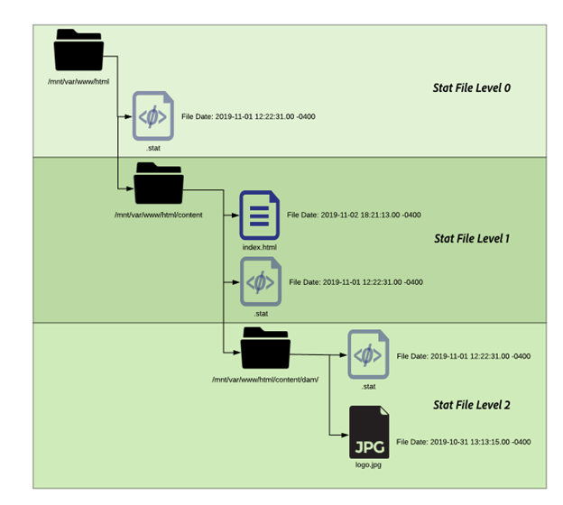

# Adobe Managed Services Dispatcher Flushing


Ontdek de nuances van mechanismen voor het leegmaken van cache en workflows voor het activeren van inhoud, die van essentieel belang zijn voor het behoud van de efficiëntie van het systeem en de gegevensintegriteit.

## Beschrijving {#description}


### Milieu

Experience Manager

### Probleem/symptomen

In dit document wordt uitgelegd hoe het leegmaken van de cache plaatsvindt en hoe het leegmaken en de validatie van de cache worden uitgevoerd.

### Hoe werkt het?

#### Bewerkingsvolgorde

De typische werkstroom wordt het best beschreven wanneer de inhoudsauteurs een pagina zullen activeren, wanneer de uitgever de nieuwe inhoud ontvangt het een spoelverzoek aan de verzender zoals aangetoond in het volgende diagram teweegbrengt:


Deze ketting van gebeurtenissen, benadrukt dat wij slechts punten spoelen wanneer zij nieuw of veranderd zijn.  Dit zorgt ervoor dat de inhoud door de uitgever vóór het ontruimen van het geheime voorgeheugen is ontvangen om rasvoorwaarden te vermijden waar het bloeden kon voorkomen alvorens de veranderingen van uitgever kunnen worden opgepikt.

#### Replication Agents

Op auteur is er een replicatieagent die wordt gevormd om bij de uitgever te wijzen dat wanneer iets wordt geactiveerd het teweegbrengt om het dossier en alle gebiedsdelen van het naar de uitgever te verzenden.

Wanneer de uitgever het dossier ontvangt, heeft het een replicatieagent die aan punt bij de verzender wordt gevormd die op de gebeurtenis op-receive teweegbrengt. Het zal dan een spoelverzoek in series vervaardigen en het posten aan de verzender.

<b>Auteur Replication Agent</b>

Hier zijn sommige voorbeeldschermafbeeldingen van een gevormde standaardreplicatieagent:


Er zijn typisch 1 of 2 replicatieagenten die op de auteur voor elke uitgever worden gevormd zij inhoud aan repliceren.

- Eerst is de standaard replicatieagent die inhoudsactivering aan duwt.
- Ten tweede is de reverse agent.  Dit is facultatief en is opstelling om op outbox van elke uitgever te controleren om te zien of is er nieuwe inhoud om in de auteur als omgekeerde replicatieactiviteit te trekken


<b>Replicatie uitgever Ahent</b>

Hier is een voorbeeld screenshots van een gevormde standaard flush replicatieagent:


<b>Dispatcher Flush Replication Receiving Virtual Host</b>

De verzendermodule zoekt naar bepaalde kopballen om te weten wanneer een verzoek van de POST iets is om tot AEM over te gaan teruggeeft of als het als een spoelverzoek in series wordt vervaardigd en door de verzender manager zelf moet worden behandeld. Hier is een schermafbeelding van de configuratiepagina met deze waarden:


De standaardinstellingspagina toont de <b>Type serienummering</b> als *Dispatcher Flush* en stelt het foutniveau in:


Op de <b>Vervoer</b> kunt u zien dat de URI wordt ingesteld om het IP-adres te richten van de verzender die de verzoeken om uitspoelen ontvangt. Het pad `/dispatcher/invalidate.cache` is niet hoe de module bepaalt als het een flush is; het is slechts een duidelijk eindpunt u in het toegangslogboek kunt zien om het te weten een spoelverzoek was. Op de <b>Uitgebreid</b> tab, gaan wij over de dingen die daar zijn om te kwalificeren dat dit een spoelverzoek aan de verzender module is.


De methode van HTTP voor spoelverzoeken is enkel een verzoek van de GET met sommige speciale verzoekkopballen:

- <b>CQ-actie</b>\
  Dit gebruikt een AEM variabele die op het verzoek wordt gebaseerd en de waarde typisch activeert of schrapt
- <b>CQ-handler</b>\
  Dit gebruikt een AEM variabele die op het verzoek wordt gebaseerd en de waarde is typisch de volledige weg aan het punt dat bijvoorbeeld /content/dam/logo.jpg wordt gespoeld
- <b>CQ-pad</b>\
  Dit gebruikt een AEM variabele die op het verzoek wordt gebaseerd en de waarde is typisch de volledige weg aan het punt dat wordt gespoeld bijvoorbeeld /content/dam
- <b>Host</b>\
  Dit is waar de Kopbal van de Gastheer spoofd wordt om specifiek te richten `<` VirtualHost`>`  die is geconfigureerd op de Apache-webserver van de verzender (/etc/httpd/conf.d/enabled_vhosts/aem_flush.vhost). Het is een harde gecodeerde waarde die een ingang in het a_em_flush.vhost dossier ServerName of ServerAlias aanpast




Op de <b>Triggers</b> tab nemen we nota van de schakelbare triggers die we gebruiken en wat ze zijn

- <b>Standaardwaarde negeren</b>\
  Dit wordt toegelaten zodat wordt de replicatieagent niet teweeggebracht op een paginaactivering. Dit is iets dat wanneer een auteursinstantie een verandering in een pagina zou aanbrengen een flush zou teweegbrengen. Omdat dit een uitgever is die wij niet van dat type van gebeurtenis willen teweegbrengen.
- <b>Bij ontvangst</b>\
  Wanneer een nieuw bestand wordt ontvangen, willen we een uitlijneffect activeren. Dus wanneer de auteur ons een bijgewerkt bestand stuurt, wordt een aanvraag voor uitspoelen geactiveerd en verzonden naar de dispatcher.
- <b>Geen versie</b>\
  We controleren dit om te voorkomen dat de uitgever nieuwe versies genereert omdat er een nieuw bestand is ontvangen. We vervangen gewoon het bestand dat we hebben en vertrouwen erop dat de auteur de versies bijhoudt in plaats van de uitgever.


Nu als wij kijken hoe een typisch spoelverzoek in de vorm van een krullbevel kijkt


```
$ curl \
-H "CQ-Action: Activate" \
-H "CQ-Handle: /content/dam/logo.jpg" \
-H "CQ-Path: /content/dam/" \
-H "Content-Length: 0" \ 
-H "Content-Type: application/octect-stream" \
-H "Host: flush" \
http://10.43.0.32:80/dispatcher/invalidate.cache
```


Met dit uitlijnvoorbeeld wordt het `/content/dam` pad door het bijwerken `.stat` in die map.

#### Het .stat-bestand

Het spoelmechanisme is eenvoudig van aard en wij willen het belang van het <b>.stat</b> bestanden die worden gegenereerd in de hoofdmap van het document waar de cachebestanden worden gemaakt.

Binnen de `.vhost` en `_farm.any` bestanden, configureren we een basisinstructie voor het document om op te geven waar de cache zich bevindt en waar de bestanden moeten worden opgeslagen/opgeslagen wanneer een aanvraag van een eindgebruiker wordt ontvangen.

Als u de volgende opdracht op de verzenderserver zou uitvoeren, zou u zoeken `.stat` bestanden.

`$ find /mnt/var/www/html/ -type f -name ".stat"`

Hier is een diagram van hoe deze dossierstructuur eruit zal zien wanneer u punten in het geheime voorgeheugen hebt en een spoelverzoek hebben die door de verzender module wordt verzonden en wordt verwerkt:



<b>Startbestandsniveau</b>

In elke map was er een .stat-bestand aanwezig. Dit is een indicator dat een spoeling is voorgekomen.  In het voorbeeld boven het <b>Statistische bestandsniveau</b> instellen op <b>3</b> binnen het overeenkomstige dossier van de landbouwbedrijfconfiguratie.

De instelling voor het bestandsniveau van de status geeft aan hoeveel mappen diep de module een .stat-bestand doorloopt en bijwerkt. Het .stat-bestand is leeg en is alleen een bestandsnaam met een datumstempel en kan zelfs handmatig worden gemaakt, maar met de aanraakopdracht op de opdrachtregel van de verzenderserver.

Als de instelling voor het eerste bestandsniveau te hoog is, doorloopt elke aanvraag voor uitspoelen de mapstructuur die de statusbestanden aanraakt.  Dit kan een grote prestatiesdruk op grote geheim voorgeheugenbomen worden en kan de algemene prestaties van uw verzender beïnvloeden.

Als u dit bestandsniveau te laag instelt, kan een aanvraag voor uitspoelen ertoe leiden dat er meer wordt gewist dan u had bedoeld. Dit zou er op zijn beurt voor zorgen dat de cache vaker wordt afgespeeld met minder aanvragen uit de cache en dat er prestatieproblemen kunnen optreden.

<b>Opmerking:</b> Stel de status op een redelijk niveau in.  Bekijk de mapstructuur en zorg ervoor dat deze zo is ingesteld dat beknopte opmaakelementen mogelijk zijn zonder dat u te veel mappen hoeft te doorlopen. Test het en zorg ervoor het aan uw behoeften tijdens een prestatietest van het systeem past.

Een goed voorbeeld is een site die talen ondersteunt. De typische inhoudsboom zou de volgende folders hebben: `/content/brand1/en/us/`

In dit voorbeeld wordt een instelling 4 voor het basisbestandsniveau gebruikt. Dit zorgt ervoor dat je inhoud die onder de <b>ons</b> map die er niet toe leidt dat de taalmappen ook leeggemaakt worden.

<b>Tijdstempel van bestand starten Handshake</b>

Wanneer een verzoek om inhoud in de zelfde routine komt gebeurt:

1. Tijdstempel van het .stat-bestand wordt vergeleken met de tijdstempel van het gevraagde bestand
2. Als het .stat-bestand nieuwer is dan het gevraagde bestand, wordt de inhoud in de cache verwijderd en wordt er een nieuw bestand opgehaald uit AEM en in cache geplaatst. Vervolgens wordt de inhoud weergegeven
3. Als het .stat-bestand ouder is dan het gevraagde bestand, weet het dat het bestand vers is en kan het de inhoud leveren.


<b><u>Cache-handler: voorbeeld `[` 1`]` </u></b>

In het bovenstaande voorbeeld wordt een aanvraag voor de inhoud /content/index.html

De tijd van het bestand index.html is 2019-11-01 @ 6:21PM

De tijd van het dichtstbijzijnde .stat-bestand is 2019-11-01 @ 12:22PM

Begrijpen wat wij hierboven hebben gelezen kunt u zien dat het indexdossier nieuwer is dan het .stat dossier en het dossier van geheime voorgeheugen aan het eind - gebruiker zou worden gediend die het vroeg.

<b><u>Cache-handler: voorbeeld `[` 2`]` </u></b>

In het bovenstaande voorbeeld wordt een aanvraag voor de inhoud /content/dam/logo.jpg

De tijd van het bestand logo.jpg is 2019-10-31 @ 1:13 PM

De tijd van het dichtstbijzijnde .stat-bestand is 2019-11-01 @ 12:22PM

Zoals u in dit voorbeeld kunt zien is het bestand ouder dan het .stat-bestand en wordt het verwijderd en wordt er een nieuwe uit AEM gehaald om het in de cache te vervangen voordat het wordt verzonden naar de eindgebruiker die het heeft aangevraagd.

### Farm File Settings

De documentatie is allen hier voor de volledige reeks configuratieopties:[Handleiding AEM Dispatcher](https://experienceleague.adobe.com/en/docs/experience-manager-dispatcher/using/configuring/dispatcher-configuration#configuring-dispatcher_configuring-the-dispatcher-cache-cache)

We zullen er enkele willen benadrukken die betrekking hebben op het leegmaken van de cache.

#### Hoofddocument

Deze configuratieingang leeft in de volgende sectie van het landbouwbedrijfdossier:


```
/myfarm {
    /cache {
        /docroot
```


U geeft de map op waarin de verzender de cachemap moet vullen en beheren.

<b>Opmerking: </b>Deze map moet overeenkomen met de hoofdinstelling van het hoofddocument voor het domein waarvoor uw webserver is geconfigureerd.

Het is om vele redenen niet erg om per bedrijf geneste docroot-mappen te hebben die een submap van de hoofdmap van het hoofddocument van de hoofdmap van de hoofdmap van de hoofdmap van de hoofdmap van de hoofdmap van de hoofdmap van de hoofdmap van de hoofdmap van de hoofdmap van de hoofdmap van de hoofdmap van de hoofdmap van de hoofdmap van de hoofdmap leven.

#### Bestandsniveau starten

Deze configuratieingang leeft in de volgende sectie van het landbouwbedrijfdossier:


```
/myfarm {
    /cache {
        /statfileslevel
```


Deze instelling bepaalt hoe diep .stat-bestanden moeten worden gegenereerd wanneer er een aanvraag voor uitspoelen wordt ontvangen.

De `/statfileslevel` ingesteld op het volgende nummer met de hoofdmap van het document `/var/www/html/` zou de volgende resultaten hebben bij flushing `/content/dam/brand1/en/us/logo.jpg`

- 0 - De volgende statusbestanden worden gemaakt
   - /var/www/html/.stat
- 1 - De volgende statusbestanden worden gemaakt
   - /var/www/html/.stat
   - /var/www/html/content/.stat
- 2 - De volgende statusbestanden worden gemaakt
   - /var/www/html/.stat
   - /var/www/html/content/.stat
   - /var/www/html/content/dam/nl.stat
- 3 - De volgende statusbestanden worden gemaakt

   - /var/www/html/.stat
   - /var/www/html/content/.stat
   - /var/www/html/content/dam/nl.stat
   - /var/www/html/content/dam/brand1/.stat
- 4 - De volgende statusbestanden worden gemaakt

   - /var/www/html/.stat
   - /var/www/html/content/.stat
   - /var/www/html/content/dam/nl.stat
   - /var/www/html/content/dam/brand1/.stat
   - /var/www/html/content/dam/brand1/nl/stat
- 5 - De volgende statusbestanden worden gemaakt

   - /var/www/html/.stat
   - /var/www/html/content/.stat
   - /var/www/html/content/dam/nl.stat
   - /var/www/html/content/dam/brand1/.stat
   - /var/www/html/content/hell/brand1/en/.stat
   - /var/www/html/content/hell/brand1/en/us/.stat


<b>Opmerking:</b>Houd er rekening mee dat wanneer de tijdstempelhandshake plaatsvindt, deze zoekt naar het dichtstbijzijnde .stat-bestand.

Met een .stat-bestandsniveau 0 en een stat-bestand alleen op `/var/www/html/.stat` betekent dat inhoud die onder `/var/www/html/content/dam/brand1/en/us/` zou zoeken naar het dichtstbijzijnde .stat-bestand en 5 mappen doorlopen om het enige .stat-bestand te zoeken dat bestaat op niveau 0 en datums met dat bestand te vergelijken. Betekent dat één spoeling bij dat hoge niveau van een niveau eigenlijk alle punten in het cachegeheugen ongeldig zou maken.

#### Ongeldige validatie toegestaan

Deze configuratieingang leeft in de volgende sectie van het landbouwbedrijfdossier:


```
/myfarm {
    /cache {
        /allowedClients {
```


Binnen deze configuratie is waar u een lijst van IP adressen zet die worden toegestaan om flush verzoeken te verzenden. Als een uitlijningsverzoek in de verzender komt moet het van vertrouwde IP komen. Als u dit misconfigured hebt of een flush verzoek van een niet vertrouwd IP adres verzendt zult u de volgende fout in het logboekdossier zien:


```
[ Mon Nov 11 22:43:05 2019]  [ W]  [ pid 0000 (tid 139859875000000)]  Flushing rejected from 00.00.0.00
```


#### Invalidatieregels

Deze configuratieingang leeft in de volgende sectie van het landbouwbedrijfdossier:


```
/myfarm {
    /cache {
        /invalidate {
```


Deze regels geven meestal aan welke bestanden ongeldig mogen worden gemaakt met een aanvraag om de bestandsextensie te verwijderen.

Als u wilt voorkomen dat belangrijke bestanden ongeldig worden gemaakt met activering van een pagina, kunt u spelregels invoeren die aangeven welke bestanden ongeldig moeten worden gemaakt en welke bestanden handmatig ongeldig moeten worden gemaakt. Hier volgt een voorbeeldset van configuraties waarmee alleen HTML-bestanden ongeldig kunnen worden gemaakt:


```
/invalidate {
   /0000 { /glob "*" /type "deny" }
   /0001 { /glob "*.html" /type "allow" }
}
```


## Resolutie {#resolution}


### Testen/problemen oplossen

Wanneer u een pagina activeert en het groene licht krijgt dat de pagina-activering is gelukt, moet u ook verwachten dat de inhoud die u hebt geactiveerd, uit de cache wordt verwijderd.

Je vernieuwt je pagina en ziet oude dingen en er is groen licht.

Laten we een paar handmatige stappen door het spoelproces volgen om ons inzicht te geven in wat verkeerd zou kunnen zijn.  Voer vanuit de uitgevers-shell het volgende uitlijningsverzoek met behulp van krullen uit:


```
$ curl -H "CQ-Action: Activate" \
-H "CQ-Handle: /content/<PATH TO ITEM TO FLUSH>" \
-H "CQ-Path: /content/<PATH TO ITEM TO FLUSH>" \
-H "Content-Length: 0" -H "Content-Type: application/octet-stream" \
-H "Host: flush" \
http://<DISPATCHER IP ADDRESS>/dispatcher/invalidate.cache
```


Voorbeeld van een spoelaanvraag voor de test:


```
$ curl -H "CQ-Action: Activate" \
-H "CQ-Handle: /content/customer/en-us" \
-H "CQ-Path: /content/customer/en-us" \
-H "Content-Length: 0" -H "Content-Type: application/octet-stream" \
-H "Host: flush" \
http://169.254.196.222/dispatcher/invalidate.cache
```


Zodra u van het verzoekbevel aan de dispatcher hebt in brand gestoken zult u willen zien wat het in de logboeken en wat het met de .stat dossiers doet. Til het logboekdossier en u zou de volgende ingangen moeten zien om de het leegmaken verzoek te bevestigen raakten de module van de dispatcher


```
[ Wed Nov 13 16:54:12 2019]  [ I]  [ pid 19173:tid 140542721578752]  Activation detected: action=Activate [ /content/dam/logo.jpg] 
[ Wed Nov 13 16:54:12 2019]  [ I]  [ pid 19173:tid 140542721578752]  Touched /mnt/var/www/html/.stat
[ Wed Nov 13 16:54:12 2019]  [ I]  [ pid 19173:tid 140542721578752]  Touched /mnt/var/www/html/content/.stat
[ Wed Nov 13 16:54:12 2019]  [ I]  [ pid 19173:tid 140542721578752]  Touched /mnt/var/www/html/content/dam/.stat
[ Wed Nov 13 16:54:12 2019]  [ I]  [ pid 19173:tid 140542721578752]  "GET /dispatcher/invalidate.cache" 200 purge [ publishfarm/-]  0ms
```


Nu wij de module zien die en het flush verzoek wordt opgepikt erkennen moeten wij zien hoe het de .stat dossiers beïnvloedde. Voer de volgende opdracht uit en bekijk de tijdstempels wanneer u een andere keer leegt:


```
$ watch -n 3 "find /mnt/var/www/html/ -type f -name ".stat" | xargs ls -la $1"
```


Zoals u van de beveloutput kunt zien de timestamps van de huidige .stat dossiers


```
-rw-r--r--. 1 apache apache 0 Nov 13 16:54 /mnt/var/www/html/content/dam/.stat
-rw-r--r--. 1 apache apache 0 Nov 13 16:54 /mnt/var/www/html/content/.stat
-rw-r--r--. 1 apache apache 0 Nov 13 16:54 /mnt/var/www/html/.stat
```


Als we de flush opnieuw uitvoeren, ziet u de tijdstempels bijwerken


```
-rw-r--r--. 1 apache apache 0 Nov 13 17:17 /mnt/var/www/html/content/dam/.stat
-rw-r--r--. 1 apache apache 0 Nov 13 17:17 /mnt/var/www/html/content/.stat
-rw-r--r--. 1 apache apache 0 Nov 13 17:17 /mnt/var/www/html/.stat
```


Laten we onze tijdstempels voor inhoud vergelijken met onze tijdstempels voor statusbestanden


```
$ stat /mnt/var/www/html/content/customer/en-us/.stat
  File: `.stat'
  Size: 0           Blocks: 0          IO Block: 4096   regular empty file
Device: ca90h/51856d    Inode: 17154125    Links: 1
Access: (0644/-rw-r--r--)  Uid: (   48/  apache)   Gid: (   48/  apache)
Access: 2019-11-13 16:22:31.000000000 -0400
Modify: 2019-11-13 16:22:31.000000000 -0400
Change: 2019-11-13 16:22:31.000000000 -0400
 
$ stat /mnt/var/www/html/content/customer/en-us/logo.jpg
File: `logo.jpg'
  Size: 15856           Blocks: 32          IO Block: 4096   regular file
Device: ca90h/51856d    Inode: 9175290    Links: 1
Access: (0644/-rw-r--r--)  Uid: (   48/  apache)   Gid: (   48/  apache)
Access: 2019-11-11 22:41:59.642450601 +0000
Modify: 2019-11-11 22:41:59.642450601 +0000
Change: 2019-11-11 22:41:59.642450601 +0000
```


Als u naar om het even welke timestamps kijkt, zult u merken dat de inhoud een nieuwere tijd dan het .stat dossier heeft dat de module vertelt om het dossier van geheim voorgeheugen te dienen omdat het nieuwer is dan het .stat dossier.

Plaats duidelijk iets bijgewerkt de tijdstempels van dit dossier die niet het om &quot;worden &quot;leeggemaakt&quot;of worden vervangen kwalificeren.
