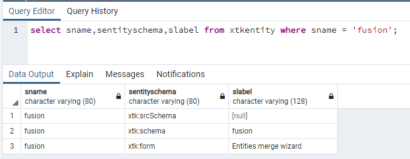

# XML-110011 ophalen Kan het element &#39;fusion&#39; niet vinden

## Beschrijving {#description}

<b>Omgeving</b>
Campaign Classic V7

<b>Probleem/symptomen</b>
<u>Voor gebruikers op prem</u>

Na het bevorderen van een instantie van de Campagne aan ACC-21.1 bouwt 9342 of hoger, wanneer het proberen om het even welke pakketten van de Campagne te installeren, komt de volgende fout voor:
 

## Resolutie {#resolution}

Het fusieschema (`xtk:fusion`) moet worden verwijderd tijdens de naupgrade. Maar in sommige gevallen is het schema nog steeds aanwezig.

Wanneer u de database als volgt opvraagt, ziet u mogelijk de volgende records:

Om het xtk:fusieschema te verwijderen, moet u het postupgrade hulpmiddel met de &quot;-kracht&quot;optie in werking stellen:

`nlserver config -postupgrade -allinstances -force`

U dient het volgende te zien:

Als het schema nog aanwezig is, kunt u het met het `"-force -repair"` opties:

`nlserver config -postupgrade -allinstances -force -repair`

Als het nog steeds niet werkt, moet u de records mogelijk handmatig uit de database verwijderen.
