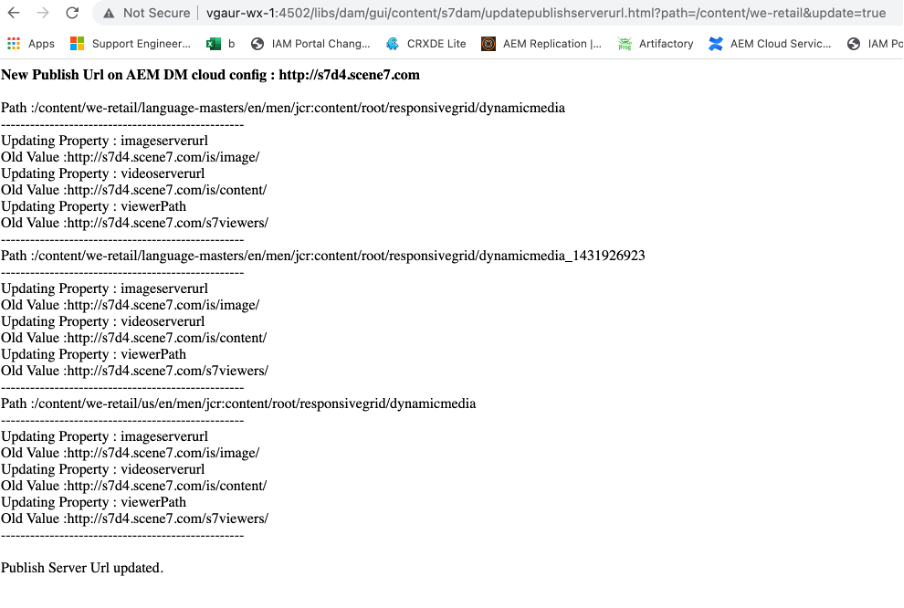

# Dynamic Media-URL wijzigen voor DM-elementen

In dit artikel wordt uitgelegd hoe u de Dynamic Media-URL voor DM-elementen wijzigt.

## Beschrijving {#description}

### Omgeving

- Experience Manager Assets
- Experience Manager 6.5

### Probleem/symptomen

Op uw Adobe Experience Manager (AEM) Author Instance (versie 6.5.11 en hoger) kunt u de sectie General Settings gebruiken om DM Server-instellingen te configureren en de URL van de Publishing Server of Dynamic Media URL voor uw DM-elementen te wijzigen.

Als u de pagina Dynamic Media General Settings wilt openen, klikt u op de AEM Author Instance op <b>Gereedschappen</b>en ga vervolgens naar <b>Activa</b>en ga vervolgens naar <b>Dynamic Media General-instelling</b>.

Controleer of u Dynamic Media hebt geconfigureerd voor uw AEM Auteur Instance. Klikken op <b>Gereedschappen</b>en ga vervolgens naar<b> Cloud Servicen</b> ga vervolgens naar <b>Dynamic Media-configuratie</b>.

Gepubliceerde servernaam is CDN-server (Content Deliver Network) die wordt gebruikt in alle door het systeem gegenereerde URL-aanroepen die specifiek zijn voor uw Dynamic Media-account.

Zorg ervoor uw naam van het douanedomein of aan de Server van het Netwerk van de Distributie van de Inhoud van de Adobe (CDN) in kaart wordt gebracht of in het geval u uw eigen CDN-provider domeinnaam gebruikt, zou het aan onze Server van de Oorsprong moeten worden in kaart gebracht \*

\*Neem contact op met de Adobe Dynamic Media Support voor meer informatie.

## Resolutie {#resolution}

Nadat u de naam van de gepubliceerde server hebt gewijzigd, slaat u de wijzigingen op. Niet wijzigen <b>Naam oorspronkelijke server</b> tenzij een Adobe-Dynamic Media hiervoor instructies heeft gegeven.

Instructies om de Gepubliceerde Naam van de Server voor bestaande componenten van Dynamic Media op uw pagina&#39;s van Plaatsen te veranderen:

- Installeer het bijgevoegde pakket om het knooppunt Publish Server URLs te maken
- Nadat het pakket is geïnstalleerd, worden er twee bestanden op de AEM Auteur gemaakt

   - [/libs/dam/gui/content/s7dam/updatepublishserverurl](http://vgaur-wx-1:4502/crx/de/index.jsp#/crx.default/jcr%3aroot/libs/dam/gui/content/s7dam/updatepublishserverurl "Pad weergeven in CRXDE Lite")
   - [/libs/dam/gui/components/s7dam/updatepublishserverurl/updatepublishserverurl.js](http://vgaur-wx-1:4502/crx/de/index.jsp#/crx.default/jcr%3aroot/libs/dam/gui/components/s7dam/updatepublishserverurl/updatepublishserverurl.jsp "Pad weergeven in CRXDE Lite")p

.         

- &#x200B; &#x200B; &#x200B; &#x200B; &#x200B; voert u uw AEM Sites-pad in op de parameter &quot;path&quot; op deze URL: http://`<` em-server`>` :portnumber/libs/dam/gui/content/s7dam/updatepublishserverurl.html?path=/content/mysite&amp;update=true &#x200B; &#x200B; &#x200B; &#x200B; &#x200B; &#x200B; &#x200B;
- Als u die URL gebruikt, worden de DM-URL&#39;s voor alle Dynamic Media-componenten automatisch bijgewerkt op alle sitepagina&#39;s op het door u opgegeven AEM Sites-pad en wordt dit type uitvoer weergegeven

Alle Dynamic Media-component-URL&#39;s worden gewijzigd in de nieuwe gepubliceerde servernaam voor uw AEM site.
Dit is een weergave van een DM-component met de oude gepubliceerde servernaam

Dit is een weergave van de DM-component, de naam van de gepubliceerde server wordt gewijzigd nadat deze URL is geactiveerd: http://`<` em-server`>` :portnumber/libs/dam/gui/content/s7dam/updatepublishserverurl.html?path=/content/mysite&amp;update=true

Opmerking: als u een lijst wilt ophalen met alle Dynamic Media-componenten op het AEM Sites-pad, kunt u deze URL aanroepen: <u style="text-decoration:underline">http://`<` em-server`>` :portnumber/libs/dam/gui/content/s7dam/updatepublishserverurl.html?path=/content/mysite</u>

&#x200B; &#x200B; &#x200B; &#x200B; &#x200B; &#x200B;
