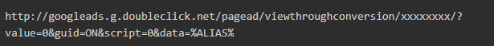

# Google-bestemming - AAM

Leer hoe u in dit artikel de URL-bestemming gedetailleerd instelt.

## Beschrijving {#description}

### Omgeving

Audience Manager

### Probleem/symptomen

In dit artikel wordt een gedetailleerd overzicht gegeven van vier hoofdvragen.

1. Hoeveel soorten Integratie hebben ze?
2. Hoe te opstelling de Bestemming S2S (server-aan-server Doelen).
3. RLSA (opmerkinglijsten voor zoekopdrachten).
4. Belangrijke punten.

## Resolutie {#resolution}

<b>Soorten bestemmingen</b>

S2S-bestemming

URL-doel

<b>URL-doel - Lijst met markeringen voor Google-advertenties</b>

Hier volgen enkele stappen die moeten worden uitgevoerd om het URL-doel in te stellen.

- In je Google Ads account: [een lijst voor het opnieuw op de markt brengen van websites maken](https://support.google.com/google-ads/answer/2454064?hl=en) en noteer uw conversie-id.
- Gebruik de volgende URL als sjabloon voor de Basis URL en Veilige URL. Vervang de sectie xxxxxxxx door uw conversie-id.

- Maak in AAM een URL-doel - Volg deze koppeling ([Een URL-doel maken](https://experienceleague.adobe.com/en/docs/audience-manager/user-guide/features/destinations/custom-destinations/create-url-destination)).
- Voeg in de sectie Segmenttoewijzingen van uw URL-doel de code uit stap 2 toe aan de velden URL en Secure URL. Plaats voor de code respectievelijk http: and https: in de velden URL en Secure URL.

Er zijn twee typen URL&#39;s

- Basis-URL OF Onveilige URL-code - Begint met HTTP

- Beveiligde URL-code - Starten met HTTPS

- Klik op Opslaan.
- Wanneer het in kaart brengen van een nieuw segment aan deze bestemming in Audience Manager, bepaal de afbeelding als <b>aam=segmentID </b>en vervangen <b>segmentID </b>met de ID van het desbetreffende segment.
- Wanneer u een emmertje definieert in Google Ads, maakt u een regel die overeenkomt met de toewijzing die is gedefinieerd in stap 6.

<b>S2S-bestemming:</b>

1. Als u wilt beginnen met het maken van S2S-doelen voor Google, CC of Consultant, wordt het accounttype doorgegeven. Het accounttype kan van de volgende typen zijn: INVITE_ADVERTISER, INVITE_PARTNER, DFP, ADX, ADX_PUBLISHER, DFP_BY_GOOGLE, DFP_BY_GOOGLE. Dit type moet ook aan het einde van de Google worden vermeld. (De gebruiker kan voor dit onderdeel contact opnemen met het Google-team).
2. Zodra dit in detail beschikbaar is, kan CC of Consultant tot de bestemming leiden.

<b>Belangrijkste punten: </b>

- De configuratie van de Bestemming van Google S2S zal gegevensoverdracht voor alle volgende 6 apparatentypes steunen:  <b>webcookie / iOS-mobile / android-mobile / Roku / Microsoft / Amazon Fire TV</b>.
- Voor het maken van een URL voor de opmerkingenlijst voor Google Ads moet u ervoor zorgen dat u <b>&quot;%ALIAS%&quot;</b> in beide typen URL&#39;s. Omdat dit een macro is die bij runtime zal worden vervangen.
- Als er fouten optreden bij het maken van de S2S-bestemming voor google, controleert u de onderstaande punten.

1. Account moet aan Google-einde witboek worden opgenomen.
2. Zorg ervoor dat u de juiste gegevens gebruikt, zoals Protocol, Servers, Format, Target-gegevensbron, enz. Gelieve te verwijzen verbinding bij S2S Segment.

