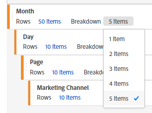

# Beperking van het aantal onderverdelingen bij het maken van rapporten in de Freeform Table Builder.

## Beschrijving {#description}

<b>Omgeving</b>

- Adobe Analytics

<b>Probleem/symptomen</b>

Wanneer het creëren van een rapport in de Bouwer van de Lijst, die één van de eigenschappen van Werkruimte in Adobe Analytics is, is het aantal Onderbrekingen beperkt tot vijf punten, in tegenstelling tot Rijen.

## Resolutie {#resolution}

Op dit moment is het maximumaantal uitsplitsingen vijf posten. Daarom om het resultaat van de Onderverdeling van meer dan vijf punten te tonen, is het noodzakelijk om een rapport met de Bouwer van de Lijst eens met vijf punten tot stand te brengen en dan Onderverdeling manueel voor de vereiste te plaatsen.

Als u bijvoorbeeld de waarden &quot;Rijen: 10 items&quot; en &quot;Uitsplitsing: 5 items&quot; instelt, worden alleen de bovenste 5 items in het weergegeven rapport uitgesplitst. In dat geval, na het produceren van het rapport, kunt u Onderverdeling voor de bodem vijf punten manueel toevoegen om de resultaten van alle tien punten te bevestigen die worden verdeeld. Als het rapport ook op de volgende pagina bestaat, zal het aantal manueel vastgestelde resultaten van de Onderverdeling (10 punten) op de volgende pagina worden getoond, zodat zult u niet het op de volgende pagina moeten opnieuw plaatsen.
