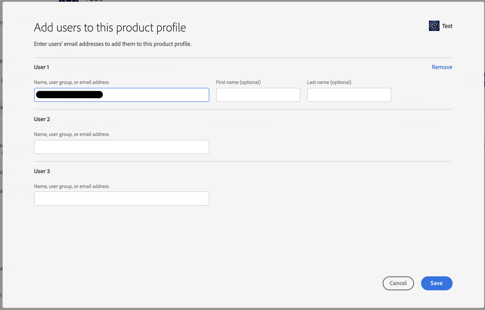

# AAM optie voor het koppelen van AD-groep aan AAM groep wordt niet weergegeven

Leer hoe te om een het productprofiel van de Audience Manager aan een Audience Manager op rol-Gebaseerde de toestemmingengroep van het Toegangsbeheer te synchroniseren.

## Beschrijving {#description}

<b>Omgeving</b>

Adobe Audience Manager

<b>Probleem/symptomen</b>

Hoe te om een het productprofiel van de Admin Console aan een Audience Manager op rol-Gebaseerde de toestemmingengroep van het Toegangsbeheer (RBAC) te synchroniseren?

## Resolutie {#resolution}

De gebruiker moet beheerdertoegang tot Audience Manager en product admin toegang in de Admin Console hebben.

1. Creeer een RBAC toestemmingsgroep in Audience Manager. Noteer de gekozen naam van de machtigingengroep:

   
2. Navigeer naar het product van de Audience Manager in de Admin Console en maak een nieuw productprofiel door de machtigingengroep te selecteren die in het drop-down menu wordt gecreeerd:

   
3. Voeg relevante gebruikers toe aan het gemaakte productprofiel:

   

