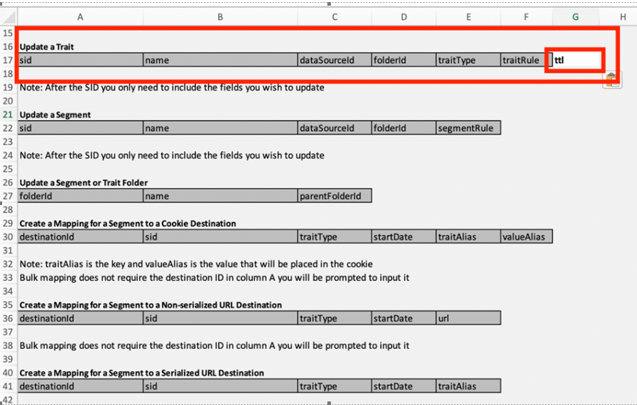

# De vervaldatum/TTL van kenmerken in bulk wijzigen met BAAAM-gereedschap

Leer hoe u de tijd-tot-live verhouding van sporen bulksgewijs wijzigt met het Hulpprogramma van de Associatie van de Audience van de Partij van de Partij.

## Beschrijving {#description}

Hoe u de tijd-naar-live wijziging van Traits in bulk wijzigt met het BAAM Tool (Batch Audience Association Manager Tool).

## Resolutie {#resolution}

Vernieuwen [Bulkbeheertool van Audience Manager](https://experienceleague.adobe.com/en/docs/audience-manager/user-guide/reference/bulk-management-tools/bulk-management-intro) voor meer informatie over de BAAAM-tool.

Pas de kopballen aan om een gebied van TTL toe te voegen en in uw voorkeur te veranderen - zie hieronder het schermschot

- Geschikte toegang tot bewerkingseigenschap is vereist.
- Zorg ervoor dat u de juiste set waarden doorgeeft voor SID, TRAIT TYPE enzovoort. Bij twijfel kunt u de optie &#39;Handelingen aanvragen&#39; in het BAAAM-hulpprogramma (Batch Audience Association Manager Tool) gebruiken om bestaande gegevens op te halen en in uw verzoeken te gebruiken.

