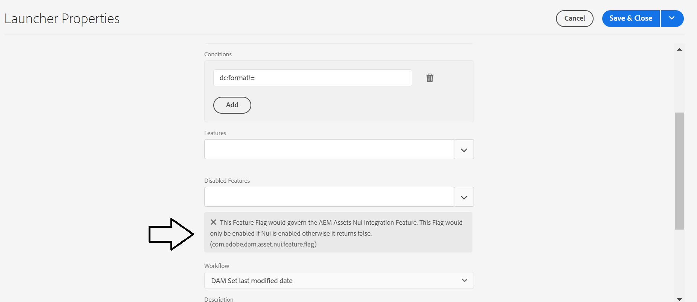

# Fout bij starten voor workflow voor &quot;DAM-set last modified date&quot; na update

## Beschrijving {#description}

<b>Omgeving</b>
Adobe Experience Manager

<b>Probleem</b>
Na de meest recente AEM als cloud-SDK-update ( 2022.4.7138.20220427T075748Z) wordt een aangepaste draagbaar voor de <b>DAM-set laatst gewijzigde datum</b> de start van de workflow wordt niet geactiveerd.

Er is een werkstroomstartprogramma gemaakt om de laatste gewijzigde datum bij te werken naar elementen in een bepaalde map wanneer de gebruiker metagegevens wijzigt.
De lanceerinrichting is een kopie van de standaard, maar is gemaakt onder `/conf` map en niet `/libs`.

Na de laatste SDK-upgrade wordt de startprogramma niet meer uitgevoerd.

<u>Vereisten</u>:

Een pakket met de door de klant gecreëerde lanceerinrichting die de <b>DAM-set laatst gewijzigde datum</b> workflow voor aangepaste middelen in een map <b>AEMaaCS</b> milieu.

<u>Vereisten Stappen om te reproduceren</u>:

1. Installeer het door de klant gemaakte pakket.

2. Dezelfde mapstructuur maken als de structuur die de klant in <b>AEM - Activa</b>.

3. Voeg elementen toe aan de eerder gemaakte map.

4. Alle metagegevens wijzigen (voorbeeld: *Titel*) van een element in de opgegeven map.

<u>Verwachte resultaten</u>:

De `jcr:LastModified` datum moet worden bijgewerkt.

<u>Werkelijke resultaten</u>:

De `jcr:LastModified` datum niet gewijzigd.

## Resolutie {#resolution}

<b>Oplossing</b>
Als cloudservice AEM <b>DAM-set laatst gewijzigde datum</b> de lanceerinrichting heeft <b>`com.adobe.dam.asset.nui.feature.flag`</b> markeren <b>Ingeschakeld</b>:

&quot;<b>Deze kenmerkmarkering regelt de integratiefunctie van AEM Assets Nui. Deze markering wordt alleen ingeschakeld als Nui is ingeschakeld, anders wordt false geretourneerd. (`com.adobe.dam.asset.nui.feature.flag`).</b>”

Nadat u de markering hebt verwijderd, werkt de startprogramma naar behoren.
