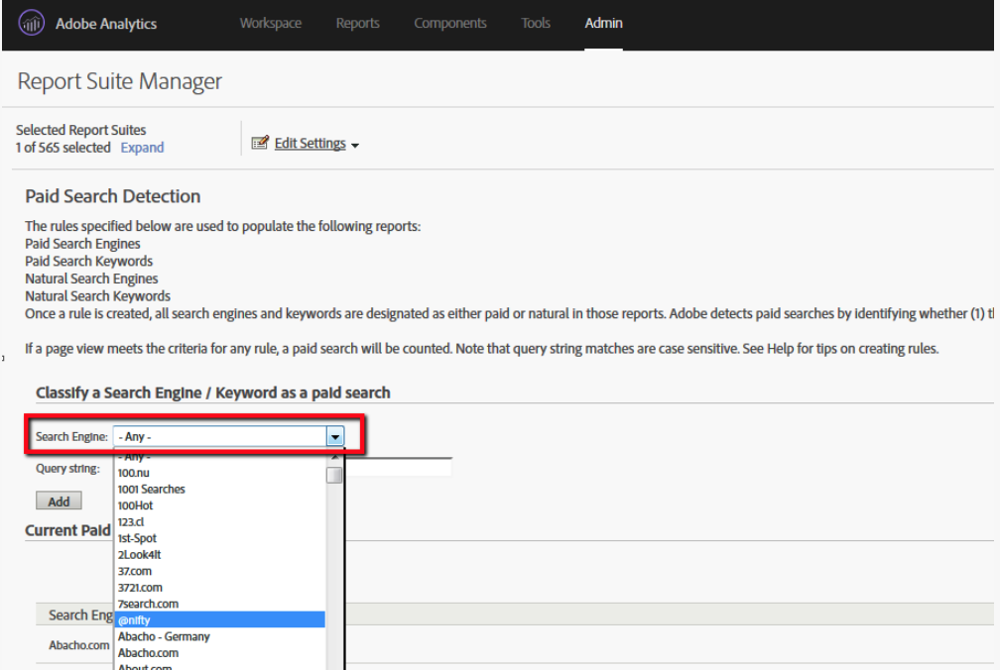

# Hoe kan ik de lijst met zoekmachines laten herkennen door Adobe Analytics?

## Beschrijving

Mag ik de lijst van de Motoren van het Onderzoek hebben die door Adobe Analytics wordt erkend?
  

## Resolutie

<b>Option1</b>

U kunt de zoekmachines die in Adobe Analytics zijn geregistreerd, snel opzoeken in het menu Detectie van Betaalde zoekopdrachten.

1. Aanmeldings-Adobe Analytics
2. Gedeelde zoekdetectie door beheerdersrapporten van de bewerkingsinstellingen
3. Zoekengine opzoeken in de vervolgkeuzelijst

<b>Option2</b>

U kunt de lijst van de Motoren van het Onderzoek die door Adobe Analytics van het &quot;onderzoek_engines.tsv&quot;dossier in de lookup_data omslag van een Diervoeder van Gegevens wordt erkend.
