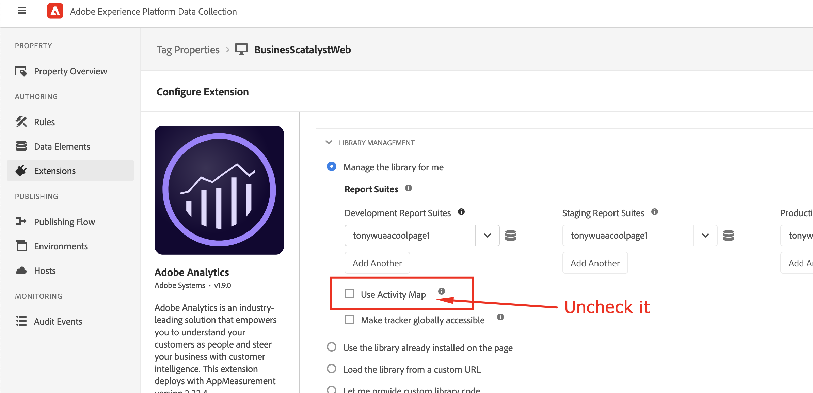

# Hoe maak de Actieve gegevensinzameling van de Kaart onbruikbaar?

## Beschrijving

Om één of andere reden, willen wij geen Actieve gegevens van de Kaart meer verzamelen; hoe kunnen wij de Actieve gegevensinzameling van de Kaart onbruikbaar maken?
  

## Resolutie

- <b>Als de Adobe Analytics-bibliotheek wordt beheerd op een clientserver (AppMeasurement.js als zelfgehoste server)</b>

Verwijder de module AppMeasurement_Module_ActivityMap uit het bestand AppMeasurement.js

- <b>Als de Adobe Analytics-bibliotheek wordt beheerd aan de zijde Adobe (AppMeasurement.js wordt gehost via de Adobe CDN)</b>

In de UI van de Inzameling van Gegevens AEP (Lanceer), ga naar de configuratie van de Uitbreiding van Adobe Analytics, en maak Activity Map door de doos onbruikbaar te ontgrendelen, dan publiceer de bouwstijl

- 

- <b>Na het onbruikbaar maken van de Actieve Kaart, wordt de controle Actieve module van de Kaart niet geladen door browser &quot;console&quot;menu door &quot;s_c_il&quot;bevel</b>

De actieve module Kaart is geladen

De actieve module Kaart is niet geladen

- <b>Nadat u de Active Map hebt uitgeschakeld, controleert u de Adobe Analytics-serveraanroep via het browsernetwerk</b>.

