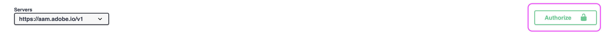

# API-toegang AAM instellen

## Beschrijving

Dit artikel schetst hoe te om een project in de ontwikkelaarsconsole tot stand te brengen om Audience Manager API JWT geloofsbrieven te produceren.

## Resolutie

U zult systeembeheerdertoestemmingen in de Admin Console nodig hebben om geloofsbrieven voor de Audience Manager API te produceren. Stappen 1 &amp; 2 schetsen hoe te om deze geëscaleerde toestemmingen te verlenen. Uw huidige systeembeheerders kunnen verkiezen deze stappen zelf te volgen eerder dan het verlenen van geëscaleerde admintoestemmingen aan een extra gebruiker, in welk geval direct overslaan aan stap 3.

1. Ga naar de [Admin Console](https://adminconsole.adobe.com/) en selecteert u [!UICONTROL Add admins] van de [!UICONTROL Quick links] menu:

   

1. Voer de e-mails in voor alle gebruikers die u toegang wilt verlenen. Selecteer op de volgende pagina &quot;[!UICONTROL System administrator]&quot; voor het machtigingsniveau:

   

1. Navigeren naar [https://developer.adobe.com/console](https://developer.adobe.com/console) . Als u nog geen toegang hebt ondanks dat u in de vorige stappen beheerrechten voor het systeem hebt gekregen, probeert u de cookies/cache te vernieuwen.

1. Maak een nieuw project van de [!UICONTROL Quick start] (of de [!UICONTROL Projects] menu in de bovenste nav):

   

1. Voeg de Audience Manager API aan uw project toe:

   

   

1. Voer de stappen uit om uw JWT-referenties te genereren (of te uploaden). Als u ervoor kiest om de geloofsbrieven via de dev console te produceren, zeker ben om de privé sleutel veilig op te slaan. U hebt later uw persoonlijke sleutel nodig. 

   

1. Vervolgens wordt u gevraagd de referenties toe te wijzen aan relevante productprofielen. Als uw organisatie op rol-gebaseerde toegangscontroles gebruikt, zult u deze stappen moeten volgen om een technische gebruikersrekening tot stand te brengen &amp; die rekening aan de relevante RBAC groep toe te voegen: [https://experienceleague.adobe.com/docs/audience-manager/user-guide/api-and-sdk-code/rest-apis/aam-api-getting-started.html?lang=en#technical-account-rbac-permissions](https://experienceleague.adobe.com/docs/audience-manager/user-guide/api-and-sdk-code/rest-apis/aam-api-getting-started.html?lang=en#technical-account-rbac-permissions)

1. Wanneer deze stappen zijn voltooid, kunt u een toegangstoken genereren om uw eerste API-aanvraag in te dienen. Klik eerst op de pagina met het overzicht van uw referenties in de Dev-console:

   

1. Klik op het tabblad &quot;JWT genereren&quot; boven aan de pagina en plak de volledige persoonlijke sleutel uit het bestand dat u in stap 6 hebt gedownload en klik op &quot;Token genereren&quot;:

   

Tot slot kunt u API verzoeken maken gebruikend het toegangstoken dat in de vorige stap wordt teruggewonnen. De vraag kan van om het even welk API platform, zoals worden gemaakt [!DNL Postman], rechtstreeks via cURL-opdrachten of zelfs vanaf de pagina met API-documentatie: [https://bank.demdex.com/portal/swagger/index.html#/](https://bank.demdex.com/portal/swagger/index.html#/)

Als u aanroepen wilt uitvoeren met behulp van de demo-functies in onze documentatie, volgt u de bovenstaande stappen om uw token te genereren en klikt u vervolgens op &quot;Autoriseren&quot; aan de rechterkant van de pagina en voert u uw token in:

Zorg er ook voor dat u de aam.adobe.io-server selecteert, zoals aangegeven in de bovenstaande schermafbeelding. U kunt nu de demo-functie gebruiken voor alle API-aanvragen door de relevante parameters in te voeren en op de knop Uitproberen te klikken:

Vergeet niet dat hierdoor een echte API-aanvraag naar uw instantie wordt verzonden. Als u een `DELETE`, `PUT`, of `POST` verzoek, kunt u niet-bedoelde veranderingen in uw instantie aanbrengen. Zorg altijd ervoor dat u de documentatie voor elk van deze API-aanroepen zorgvuldig leest voordat u de aanvraag verzendt.

