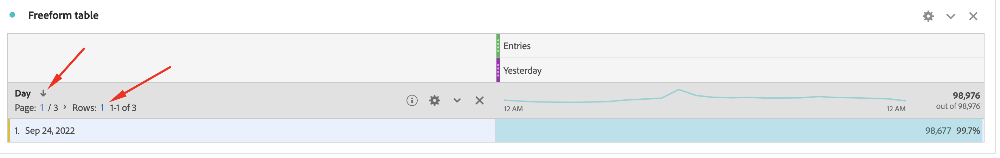

# De Metriek van ingangen Gepland Rapport omvat buiten het rapporteringsvenster

## Beschrijving

<b>Probleem:
  </b>
 Het geplande rapport van de metriek van Ingangen omvat gegevens die buiten het rapporteringsvenster zijn.
 Zoals hieronder te zien is, is het venster Rapport &quot;Gisteren&quot;, maar het geplande rapport bevatte niet alleen gegevens van gisteren (24 september), maar ook gegevens van andere dagen.
 Wat is de reden en de manier waarop de gegevens van gisteren in het geplande rapport moeten worden opgenomen?
  
  
 

## Resolutie

<b>Reden:</b>
Omdat de ingangen op bezoek-gebaseerde metrisch zijn.
Op bezoek-gebaseerde metriek, zoals Berichten en het Tarief van de Stuitage, kan gegevens aan een dag vóór de rapportbegin datumwaaier van het venster kenmerken. Het meest gebruikelijke scenario van deze toewijzing is wanneer de bezoeken middernacht overspannen. Bijvoorbeeld:

1. Een gebruiker heeft op 23 september om 23.50 uur uw startpagina bezocht.
2. Nadat de gebruiker meerdere pagina&#39;s had bezocht, heeft hij om 24:10 september uw startpagina verlaten.

In dit voorbeeld, wanneer het &quot;venster van het Rapport&quot;24 September (Gisteren) is, is dit bezoek inbegrepen in het rapport. 
Nochtans, omdat de metriekattributen van Berichten aan 23 September, &quot;Sep 23.2022&quot;van het Dimension van de Dag ook in het rapport zullen worden getoond.
 
<b>Oplossing:</b>
Het is Werk als Ontwerp, maar als tussenoplossing, kunt u het aantal van Rijen plaatsen als 1, de dimensie van de Dag in fatsoenlijk sorteren, dan sparen en herplannen het rapport. U kunt een rapport ontvangen waarin alleen de gegevens van &quot;Gisteren&quot; als onderstaande afbeelding zijn opgenomen.
 

