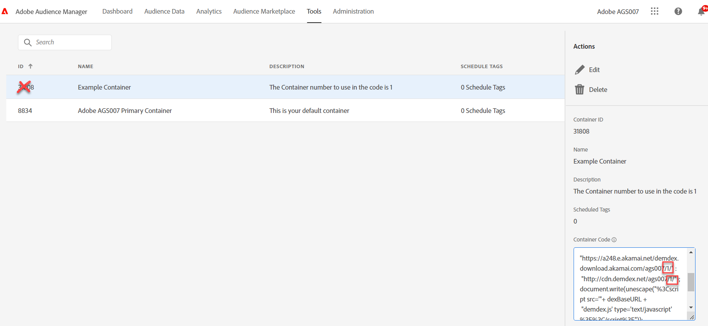

# Wat is Audience Manager (de Dienst van identiteitskaart) Container ID en waar om het te vinden

## Beschrijving {#description}

<b>Omgeving</b>
Audience Manager

<b>Probleem/symptomen</b>
Wanneer een containeridentiteitskaart buiten het gebrek (0) voor een AAM (en/of de implementatie van de Dienst van identiteitskaart) wordt vereist, hoe weet men welke containeridentiteitskaart aan gebruik? Is het de container identiteitskaart in AAM UI of één of andere andere waarde?

## Resolutie {#resolution}

Wanneer een AAM implementatie een verschillende containeridentiteitskaart in plaats van standaard/standaardcontainer (0) moet gebruiken, dan is de waarde om in de dienst van identiteitskaart en de Module van het Beheer van de Publiek voor Analytics (of in de de configuratiecode van de DIL) te zetten het containeraantal dat op wordt gebaseerd toen de container werd gecreeerd, NIET de containeridentiteitskaart in AAM UI. Ga als volgt te werk om de juiste waarde op te halen.

1. Aanmelden <b>Audience Manager </b>en klik op <b>Gereedschappen</b><b>Tags.</b>
2. Wanneer de pagina van Markeringen laadt, klik op <b>container</b> in kwestie.
3. Zoek in de rechterspoorlijn de <b>Containercode.</b>
4. Zoek de *akamai.net* of *cdn.demdex.net* verzoek. Het getal in het pad net na de huurder-id is de numerieke waarde die in de code moet worden gebruikt. Gebruik de container-id niet. In het onderstaande voorbeeld/screenshot is de te gebruiken waarde 1.

<b>Opmerking</b>: De code in het vak Containercode is geen code die u op wegeigenschappen moet plaatsen. Het is hier alleen om de Container-waarde op te halen die nodig is voor de `idSyncContainerID` configuratie van de id-service, de `containerNSID` waarde van de module Audience Management of de `containerNSID` waarde van een DIL-implementatie wanneer iets anders dan de standaard-id-synchronisatiecontainer nodig is.

