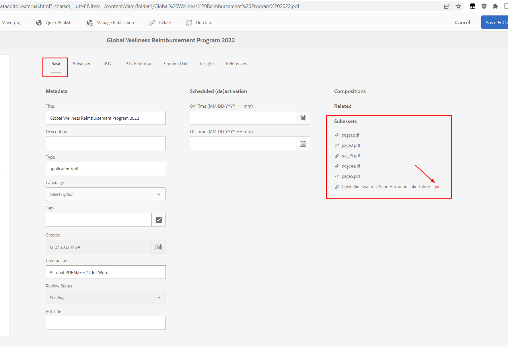

# Status SUB-ACTIVA weergegeven voor activum

## Beschrijving {#description}

Tijdens het bladeren door het element geven sommige activa de status &quot;SUB-ASSET&quot; weer:

Wat betekent dit?

## Resolutie {#resolution}

De <b>*SUBACTIVA</b>* status komt overeen met wanneer uw element een <b>gerelateerde activa</b> waarvoor *Digital Rights Management* datum verstreken.

Dit is een specifiek geval van het scenario waarin het hoofdactief zelf verstreek, zoals hier beschreven:

[https://experienceleague.adobe.com/docs/experience-manager-65/assets/administer/drm.html?lang=en#asset-expiration](https://experienceleague.adobe.com/docs/experience-manager-65/assets/administer/drm.html?lang=en#asset-expiration)

U kunt controleren welk verwant element is verlopen door de eigenschappen van het element te openen *Basis* en de *rode vlag* pictogram:

De <b>gerelateerde activa</b> het gaat om twee soorten :

<u><b>#1 - Element is een PDF met subpagina&#39;s</b></u>

Als u uw &quot;DAM Update-element&quot; hebt gewijzigd om pagina&#39;s uit uw PDF te extraheren, wordt er een subelement voor de documentpagina&#39;s gemaakt.

Elke uitgenomen pagina is een element dat is opgeslagen onder het hoofdelement in een subknooppunt/map met de naam &quot;/subassets&quot; en heeft metagegevenseigenschappen, waaronder DRM *Verloopt* datum in de *Geavanceerd* tab.

Indien *Verloopt* De datum is verstreken. U ziet:

- de <b>*VERLOPEN</b>* status voor deze subpagina/element bij het bladeren door de hoofdsubelementen van de PDF (met de linkerbovenhoek schakelt u over van *Alleen inhoud* weergeven *Submiddelen*)
- de <b>*SUBACTIVA</b>* status bij teruggaan naar hoofdPDF

Dit wordt beschreven op de volgende pagina 0.

<u><b>#2 - Element heeft verwijzingen naar elementen</b></u>

Voor elk type actief kan naar andere activa worden verwezen. De <b>*SUBACTIVA</b>* status wordt ook berekend door te kijken naar de *Verloopt* datum van elk van deze referenties.

Deze verwijzingen worden opgeslagen in een eigenschap:

*element/jcr:content/related/links/sling:members/sling:resources*

<u>Opmerking:</u>

Als uw element te veel verwijzingen heeft (duizenden), kan het sommige prestatieskwesties veroorzaken UI wanneer het proberen om de activa eigenschappen te tonen.

Het controleren/berekenen van de status van al die verwijzingen zou te veel tijd kunnen vergen, en het verzoek om de eigenschappen te openen zal tijd uit.

Er zijn te veel verwijzingen die betrekking hebben op en moeten worden onderzocht, omdat dit prestatieproblemen kan veroorzaken:

[https://jackrabbit.apache.org/oak/docs/dos_and_donts.html#Large_Multi_Value_Property](https://jackrabbit.apache.org/oak/docs/dos_and_donts.html#Large_Multi_Value_Property)

Als u het probleem wilt verhelpen en deze verwante verwijzingen geen waarde opleveren, kunt u de volgende map of subnode verwijderen uit CRX/DE:

*/content<b>t</b>/.../asset/jcr:content/related/links*

<u><b>#3 - Tips voor het controleren van verlopen middelen</b></u>

Met de volgende JCR SQL2-query kunt u alle elementen in uw opslagplaats weergeven waarvan de vervaldatum is bereikt:

*SELECT \* FROM dam:Asset WHERE jcr:content/metadata/prism:expirationDate cast(&#39;2023-01-02T17):00:00.000Z&#39; als datum)*

Wijzig de datum in de huidige tijd (in GMT-indeling).
