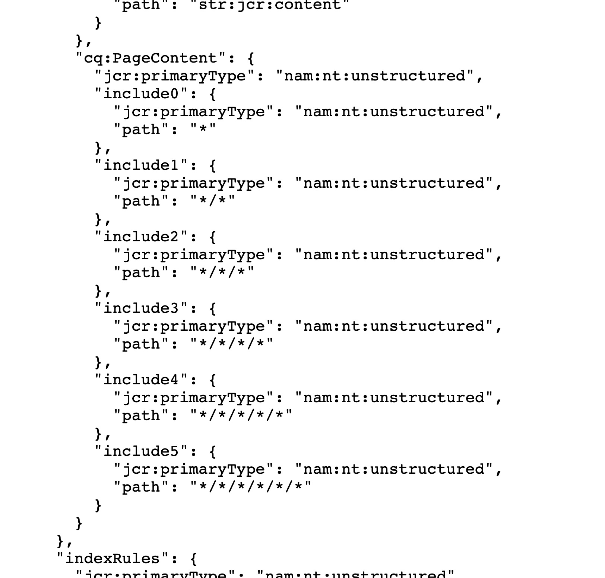

# Adobe Experience Manager: De binnenkomende koppelingen tonen niet alle koppelingspagina&#39;s

## Beschrijving {#description}

Als een knooppunt met een koppeling zich op meer dan 4 niveaus van de jcr:content op de pagina bevindt, wordt de pagina niet weergegeven in de binnenkomende koppelingen van het doel van de koppeling.

・ Wanneer een koppelingspagina wordt weergegeven in de binnenkomende koppelingen:   /content/wknd/us/nl/link-page/jcr:content 1 /root 2/container 3 /container 4/text(link)

・ Wanneer een koppelingspagina niet wordt weergegeven in de binnenkomende koppelingen:   /content/wknd/us/nl/link-page/jcr:content 1 /root 2 /container 3 /container 4 /container 5 /text(link)

<b>Omgevingen</b>
AEM as a Cloud Service, AEM 6.5

## Resolutie {#resolution}

Controleer de hiërarchie van knooppunten die de koppeling bevatten met CRXDE Lite.

Controleer de structuur van de pagina en pas deze aan, zodat het koppelingsknooppunt zich op een oppervlakkig niveau kan bevinden.
Als het niveau van de koppelende knoop op een diep niveau blijft aanpassen een index om het niveau te verhogen dat voor het inkomende die verbindingen moet worden geïndexeerd te zoeken.

Selecteer met behulp van CRX/DE Lite /oak:index/cqPageLucene/aggregates/cq:PageContent.
  Maak een nieuw knooppunt en voeg een eigenschap &#39;path&#39; toe die het vereiste hiërarchische niveau aangeeft.

- In het volgende voorbeeld worden &#39;include4&#39; en &#39;include5&#39; toegevoegd om het niveau van binnenkomende koppelingen te verhogen tot maximaal 6.

Als u opnieuw indexeren wilt uitvoeren, wijzigt u de waarde van de eigenschap redex van /oak:index/cqPageLucene in true en slaat u deze op.

  
    - Als het opnieuw indexeren is voltooid, wordt het volgende bericht weergegeven in error.log.

`    13.01.2023 12:00:45.264 *INFO* async-index-update-async org.apache.jackrabbit.oak.plugins.index.AsyncIndexUpdate async Reindexing completed for indexes: /oak:index/cqPageLucene*(788) in 733.7 ms (733 ms)`

Het opnieuw indexeren kan een prestatieprobleem veroorzaken.
    Het wordt aanbevolen de herindextaak relatief rustig te plannen.
