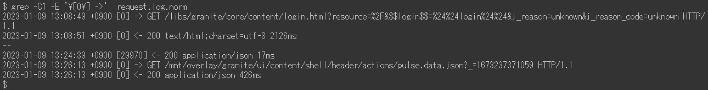

# Adobe Experience Manager: Voorbeelden van request.log-analyse

## Beschrijving {#description}

AEM request.log bevat diverse nuttige informatie, zoals responstijd, voor het analyseren van prestatieproblemen. Hier volgt een lijst met analysevoorbeelden met Linux-opdrachten (inclusief enkele externe opdrachten).

<b>Omgevingen</b>
AEM 6.5, Linux (Bash)

## Resolutie {#resolution}

Inhoudsopgave:  
<b>Inleiding</b>
  De indeling van request.log

<b>Voorbereiding</b>
  Stap 1. Gegevensreinigingsstap 2. Herstelde tijdstap 3. Aantal toegangen per uur Stap 4. Maximale gelijktijdige verwerking Stap 5. Een logbestand splitsen in stap 6. Aanvraagrecords samenvoegen en reactierecords

<b>Voorbeelden van analyses</b>
  Voorbeeld 1. Voorbeeld 2 wordt het zwaarst benaderd. Neemt het ontbrekende reactievoorbeeld 3. Trage toegang Voorbeeld 4. Gegevens uit tijdreeksen van reactietijd Voorbeeld 5. Minimum, gemiddelde (gemiddelde), mediaan, maximale responstijd Voorbeeld 6. Aantal toegangen per een periode Voorbeeld 7. Aantal responsstatussen per periode Voorbeeld 8. Meest voorkomende URL&#39;s Voorbeeld 9. access.log verslagen voor een request.log verslag

<b>Conclusie</b>

 Inleiding  De indeling van request.log  
AEM 6.5 produceert request.log in het volgende formaat door gebrek. Vanwege een systeembeperking worden de opdrachtregels in dit artikel weergegeven als afbeeldingen in plaats van als onbewerkte tekst.

Voorbeeld van request.log:

In dit artikel verwijs ik naar een regel met &quot;-&quot; als &quot;aanvraagrecord&quot;. Een regel met &quot;-&quot; is een &quot;responsrecord&quot;.

<b>Record aanvragen</b>
  Wanneer een verzoek door AEM wordt ontvangen, wordt een verzoekverslag geregistreerd. Het bevat de datum en tijd van ontvangst, verzoekidentiteitskaart, de verzoekmethode, en URL.

<b>Responsrecord</b>
  Wanneer AEM op een verzoek reageert, wordt een reactieverslag geregistreerd. Deze bevat de datum en tijd van de reactie, de aanvraag-id, de statuscode, Content-Type en de reactietijd (in milliseconden).

Zie ook de bijbehorende handleiding: https://experienceleague.adobe.com/docs/experience-manager-65/deploying/configuring/monitoring-and-maintaining.html?lang=en#interpreting-the-request-log

 Voorbereiding  Stap 1. Gegevensreiniging  
Alvorens in de analyse van request.log te duiken, is het belangrijk om de logboekverslagen te standaardiseren.

De eerste gebruikte opdracht verwijdert een extra ruimte in de records voor Inhoudssoort reactie om onjuiste veldscheiding met witruimte te voorkomen. De ruby-opdracht zet de datumnotatie om in ISO 8601. Met de opdracht Ruby worden datum en tijd ook gescheiden door witruimte in plaats van een dubbele punt.

 Stap 2. Begintijd  
Het opnieuw beginnen van AEM en een installatie van het de dienstpak stelt verzoekidentiteitskaart van request.log terug. De verzoekverslagen met verzoek identiteitskaart = 0 wijst erop dat er dergelijke soorten verrichting zou kunnen zijn.

In het bovenstaande voorbeeld zijn de aanvraag-id&#39;s opnieuw ingesteld op 0 op 13:08:49 と13:26:13.

 Stap 3. Aantal toegangen per uur  
Telling het aantal toegangen per uur en de tijdwaaier van request.log.

           
 Stap 4. Maximale gelijktijdige verwerking  
Het aantal gelijktijdige verwerkingen helpt de serverbelasting van AEM te raden.

Standaard is het maximumaantal gelijktijdige verbindingen voor Jetty in AEM ingesteld op 200. Er is een vertraging bij het vrijgeven van de socket nadat de reactie is voltooid. Als het aantal gelijktijdige verwerkingen groter is dan ongeveer 170, kunnen geen nieuwe aanvragen meer worden geaccepteerd.

 Stap 5. Een logbestand splitsen  
De verzoek-id van request.log wordt opnieuw ingesteld wanneer AEM opnieuw start of wanneer een Service Pack is geïnstalleerd. Door dit gedrag kan de analyse onjuist zijn wanneer een request.log dergelijke bewerkingen bevat. Om nauwkeurige analyse uit te voeren en de dossiergrootte te verminderen die tegelijkertijd wordt behandeld, spleet request.log gebruikend verzoekverslagen met verzoek identiteitskaart = 0.

 Stap 6. Aanvraagrecords samenvoegen en reactierecords  
Het samenvoegen van verzoek en reactieverslagen door verzoekidentiteitskaart maakt het gemakkelijker om te merken wanneer de prestatieskwesties begonnen. Ik zal dit samengevoegde logboekdossier in de recentere voorbeelden gebruiken.

Het laatste gebruikte bevel voegt een dummyreactie op verzoekverslagen toe die geen het corresponderen reactieverslag hebben. Er kunnen ook reactieverslagen zonder verzoekverslagen zijn. Maar ze zijn onwetend, omdat ze doorgaans geen kwestie van onderzoek zijn.

Het samengevoegde logbestand moet er als volgt uitzien:

           
 Voorbeelden van analyses  Voorbeeld 1. De zwaarste toegang  
Sorteer het samengevoegde logbestand op reactietijd in aflopende volgorde, inclusief toegangspunten zonder reactie.

              
 Voorbeeld 2. Ontbrekende reactie wordt benaderd  
Bij het extraheren wordt de corresponderende reactiegegevens niet weergegeven bij de dummy reactietijd.

Als de timing van het ontvangen van toegangen zonder reactie met een toename van serverlading gecorreleerd is, kunnen deze toegangen prestatieskwesties teweegbrengen.

                                
 Voorbeeld 3. Langzame toegang  
Extraheer toegang die meer dan 10 seconden duurde.

Wanneer het aantal treffers te hoog is, vervang 0-9 \ {5 \} met 0-9 \ {6 \} in het grep bevel om neer tot toegangen te versmallen die meer dan 100 seconden duurden.

 Voorbeeld 4. Reeks gegevens van de responstijd  
Het is handig alleen de tijdstempel en de reactietijd uit de gegevens te halen om grafieken te maken.

Het weglaten van toegangen die onmiddellijk antwoordden maakt de gegevens efficiënter. In het volgende voorbeeld wordt toegang die meer dan een seconde heeft geduurd, geëxtraheerd.

                    
 Voorbeeld 5. Minimum, gemiddelde (gemiddelde), mediaan, maximale responstijd  

In het bovenstaande voorbeeld wordt de opdracht datamash (https://www.gnu.org/software/datamash/) gebruikt voor statistische verwerking. Als het logboek toegang zonder reactie bevat, zal de dummywaarde het resultaat beïnvloeden.

 Voorbeeld 6. Aantal toegangen per periode  
Telt het aantal toegangen per tien minuten. Het resultaat helpt om te bepalen als het grote verkeer een prestatieskwestie veroorzaakte.

In het volgende voorbeeld worden de gegevens beperkt tot alleen POST-aanvragen. Doorgaans wordt gebruikt om te bepalen of er een concentratie is van het ontwerpen of repliceren van inhoud naar de publicatielaag.

        
 Voorbeeld 7. Aantal responsstatussen per periode  
Maak een tabel met het aantal responsstatus per tien minuten met de opdracht datamash.

           
 Voorbeeld 8. Meest voorkomende URL&#39;s  
Druk de bovenste drie URL&#39;s af die het meest per tien minuten zijn geopend.

                       
 Voorbeeld 9. access.log verslagen voor een request.log verslag  
Zoek access.log naar verslagen die aan een bepaalde verzoekidentiteitskaart beantwoorden

Als de veelvoudige toegang tot zelfde URL tezelfdertijd gebeurde, toont het resultaat veelvoudige access.log verslagen voor één enkele verzoekidentiteitskaart.

 Conclusie  
Ik hoop dat de voorbeelden in dit artikel u zullen helpen uw prestatieskwesties analyseren.

De vermelde voorbeelden zijn getest op CentOS 7.5 en Ubuntu 22.04LTS, maar werken mogelijk niet zoals verwacht, afhankelijk van uw omgeving, zoals verschillende versies of variaties van de bevelen. Pas de opdrachten aan die in de omgeving zijn geïnstalleerd.

