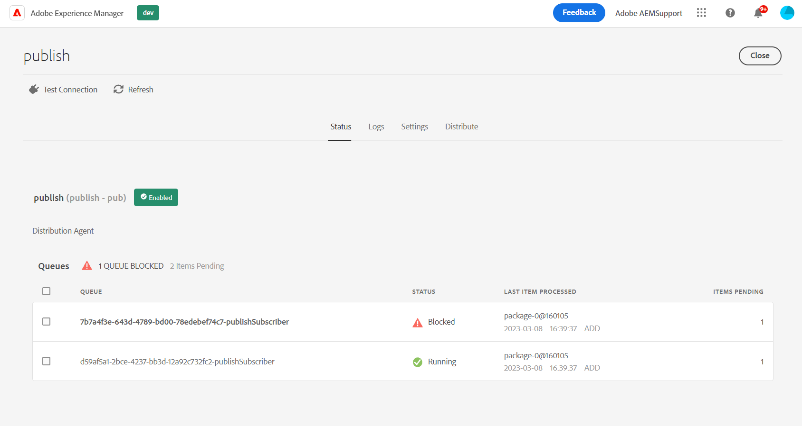

# De Rij van de distributie die met AccessDeniedException wordt geblokkeerd

Wanneer u probeert om pagina-inhoud, XF of andere bronnen te repliceren met Snel publiceren, Publicatie beheren of Repliceren, wordt de Distribution Queue op de Auteur geblokkeerd. U kunt dit controleren door *publish* De Rij van de distributie van UI (<b>AEM `>`  Gereedschappen `>`  Implementatie `>`  Distributie</b>). Voer de stappen in dit document uit om het probleem op te lossen.

## Beschrijving {#description}

### <b>Omgeving</b>

- Experience Manager
- Experience Manager als cloudservice

### <b>Problemen/symptomen</b>

Wanneer u probeert om bepaalde pagina-inhoud (of XF en andere bronnen) te repliceren met behulp van &quot;Snel publiceren&quot;, &quot;Publicatie beheren&quot; of &quot;Repliceren&quot;, wordt de Distribution Queue op Auteur <b>Geblokkeerd</b>.

Dit kan worden waargenomen door de *publish*De Rij van de distributie van UI van de Distributie (AEM - Hulpmiddelen - Plaatsing - Distributie):
       Als u de Gulden Publisher-wachtrij selecteert (vet in de lijst), worden meer details gegeven en met name de betrokkenen <b>PAD</b> (hier kunnen meerdere elementen aanwezig zijn):       Het zoeken naar <b>Logboeken</b> wordt de volgende overeenkomstige fout weergegeven:  2023/03/08 12:11:26:238 - INFO - Verzoek aanvaard met distributiepakket PackageMessage(pubSlingId=a1133c97-6809-411e-a435-4eea0ecbe889, reqType=ADD, pkgId=dstrpck-1 678277486031-63159f4b-c577-4079-8741-d41660597d20, pkgType=filevault, pkgL Length=6330, pubAgentName=publish, userId=replication-service, paths=`[` /content/wknd/fr`]` , deepPaths=`[` `]` ) bij offset=158705
 2023/03/08 12:11:27:459 - WAARSCHUWING - Bericht: Mislukte poging (0/oneindig) om het distributiepakket te importeren PackageMessage(pubSlingId=a1133c97-6809-411e-a435-4eea0ecbe889, reqType=ADD, pkgId=strpck-1678277486031-63159f4b-c577-4079-8741-d41660597d20, pkgType=Journal_filevault, pkgLength=6330, pubAgentName=publish, userId=replication-service, paths=`[` /content/wknd/fr`]` , deepPaths=`[` `]` ) bij offset=158705 vanwege &#39;javax.jcr.AccessDeniedException: OakAccess000: Access deny&#39;, zal de importeur het later opnieuw proberen,
 Stacktrace: org.apache.sling.distribution.common.DistributionException: javax.jcr.AccessDeniedException: OakAccess000: Toegang geweigerd
 `[` ..`]`       U moet *Wachtrij wissen* (of verwijder dat item) om de wachtrij te ontgrendelen. 

## Resolutie {#resolution}

Ondanks het feit dat de fout <b>`javax.jcr.AccessDeniedException`</b>, is er misschien geen verband met ACL/toestemmingen voor de gebruikers van de distributiedienst, hoewel dit zou moeten worden overwogen als het volgende scenario niet op uw geval van toepassing is.

Diagnostiek

De bovenstaande fout kan zich in een bepaalde situatie voordoen wanneer de gerepliceerde inhoud een specifieke configuratie heeft die gerelateerd is aan de speciale <b>jcr:lockIsDeep</b> eigenschap.

Om de diagnose te bevestigen, moet u <b>elk van de vermelde paden</b> met een van de volgende gereedschappen die u kunt openen/toepassen:

1. CRX/DE voor DEV-instanties
2. de [Browser voor opslagplaats](https://experienceleague.adobe.com/docs/experience-manager-cloud-service/content/implementing/developer-tools/repository-browser.html?lang=en)
3. een inhoudspakket maken in Package Manager (deze optie maakt ook deel uit van de resolutie)

Vervolgens moet u de knop <b>`jcr:content`</b> knooppunt voor elk pad dat wordt gevonden in de Distribution Queue UI, en verifieer of:

- IT <b>doet </b>een <b>`jcr:lockIsDeep`=&quot;(Boolean)true&quot;</b> eigenschap
- IT <b>niet </b>een <b>`jcr:lockOwner="xxx"`</b> eigenschap
- <b>(</b>het <b>niet</b> een <b>`mix:lockable`</b> waarde in de <b>`jcr:mixinTypes`</b>)

Als dit het geval is, wordt de kwestie bevestigd sinds <b>`jcr:lockIsDeep`</b> eigenschap mag niet alleen aanwezig zijn. Deze eigenschap moet altijd samen met de <b>`jcr:lockOwner`</b> wanneer <b>Vergrendelen</b> een pagina.

Het is niet mogelijk alleen de <b>`jcr:lockIsDeep`</b> eigenschap, zelfs met behulp van de JCR API, zodat de oorzaak van deze situatie meestal ligt in het installeren van een *bedorven* content package met die single property.

<u><b>Resolutie</b></u>

Om de inhoud te bevestigen is de enige oplossing een pakket in uw Auteur te installeren dat de correcte eigenschappen heeft die op de overeenkomstige knoop worden geplaatst.

U kunt dat pakket maken vanuit een andere instantie met de bijbehorende inhoud of als u alleen deze inhoud op de betreffende instantie hebt, kunt u de volgende instructies volgen:

1. Een pakket op de verbroken instantie genereren voor de pagina met de fout
2. Het pakket downloaden
3. Het gereedschap <b>`.content.xml`</b> voor de pagina/jcr:inhoud
4. Verwijder de lijn handmatig met de <b>jcr:lockIsDeep</b>
5. Het pakket bijwerken met de nieuwe/vaste .content.xml
6. Upload en installeer het gewijzigde pakket opnieuw

Controleer nogmaals de pagina-eigenschappen en test de replicatie/distributie met succes.
