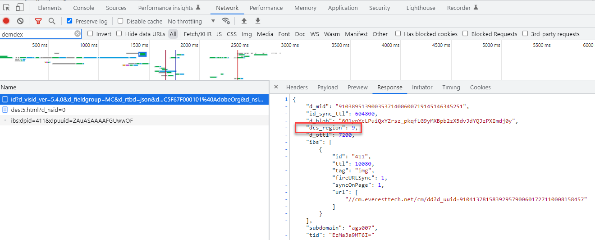

# Locatiehints, regionale DCS-knooppunten AAM en ID-servicelocaties

Leer over het verband tussen de Hints van de Plaats van Adobe Experience Platform (AEP) WebSDK, de plaatshints van de Dienst van identiteitskaart van het Experience Cloud, en de regionale Nodes van Adobe Audience Manager (AAM) DCS.

## Beschrijving {#description}

### <b>Omgeving</b>

- Experience Platform
- Audience Manager

### Probleem/symptomen

Wat is het verband tussen de Hints van de Plaats AEP (Adobe Experience Platform) WebSDK, de Dienst van identiteitskaart van het Experience Cloud, plaatshints, en AAM Regionale Nodes DCS en waarom is het belangrijk om deze verhouding te begrijpen?

## Resolutie {#resolution}

AEP WebSDK (die gegevens naar de Rand van de Ervaring) en Adobe Audience Manager (AAM) gegevensinzameling in real time gebeurt bij regionale knopen die wereldwijd worden verspreid. Er zijn 7 regionale knopen en AEP WebSDK/Experience Edge en AAM gegevensinzameling gebruiken de zelfde knopen. AAM de Servers van de Inzameling van Gegevens (DCS) gebruiken de zelfde netwerkinfrastructuur die omhoog de Rand van de Ervaring maken. Op dezelfde manier aangezien de dienst van identiteitskaart van het Experience Cloud AAM technologie gebruikt, zijn de de dienstplaatshints van identiteitskaart het zelfde als de AAM regionale knooppunten van de gegevensinzameling. Met andere woorden, AAM DCS-knooppunten = ID-servicelocatie-tips = Experience Edge-locatiepunten. AAM regionale knooppunten worden in deze [documentatie](https://experienceleague.adobe.com/docs/audience-manager/user-guide/api-and-sdk-code/dcs/dcs-api-reference/dcs-regions.html?lang=en), overwegende dat in deze [documentatie](https://experienceleague.adobe.com/docs/experience-platform/edge-network-server-api/location-hints.html?lang=en).

Hoewel AAM regionale knooppunten en ID-servicelocatie worden geïdentificeerd door getallen en Experience Edge&#39;s worden aangeduid door alfanumerieke tekens, zullen ze allemaal op dezelfde gebieden uitlijnen (behalve Brazilië).  In de onderstaande opzoektabel ziet u hoe ze worden uitgelijnd:

| Experience Edge Location Hint | Hint van servicelocatie voor DCS-gebiedknooppunt/ID |
| --- | --- |
| spg3 | ID: 3 Host: apse.demdex.net |
| irl1 | ID: 6 host: irl1.demdex.net |
| va6 | ID: 7 Host: use.demdex.net |
| aus3 | ID: 8 Host: apse2.demdex.net |
| of2 | ID: 9 Host: usw2.demdex.net |
| jpn3 | ID: 11 Host: tyo3.demdex.net |
| ind1 | ID: 12 Host: ind1.demdex.net |

De meeste Adobe Experience Cloud-functionaliteit waarvoor real-time reacties vereist zijn, gebruikt deze regionale knooppunten. De eerste vraag van de Dienst of van de Rand van de Ervaring op een Web-pagina of mobiele app bepaalt welke regionale knoop aan gebruik. De plaatswenken kunnen in antwoord op deze vraag worden gevonden:

Experience Cloud-id-service:

AEP Web SDK:

Zodra het dichtstbijzijnde regionale knooppunt aan de eindgebruiker wordt bepaald, wordt de regio-id doorgegeven via Analytics-, Target- en AEP WebSDK-aanroepen. In Analytics, wordt het overgegaan als parameter van het amlh vraagkoord:

In Doel wordt deze doorgegeven in het dialoogvenster `experienceCloud.audienceManager.locationHint` object van de aanvraaglading:

Voor AEP Web SDK, wordt de weg van de vraag bijgewerkt om op de regionale knoop te wijzen:

<b>Opmerking: </b>De eerste interactieve vraag van AEP WebSDK zal NIET de regio in de weg hebben omdat, is het gebied nog niet bepaald, maar de plaatshint zal in de reactie (zoals hierboven vermeld) zijn. Het pad van het oorspronkelijke verzoek is .../ee/v1/... Nochtans, zullen de verdere vraag de regionale knoopinformatie tussen /ee/ en /v1/ wegelementen omvatten.

Deze parameters zorgen ervoor dat de server-kant door:sturen gegevens van Analytics aan de correcte AAM randknoop door:sturen, die het Doel segmentinformatie van die zelfde randknoop vraagt, en dat [AEP-gegevens verzenden gegevens naar AAM](https://experienceleague.adobe.com/docs/audience-manager/user-guide/implementation-integration-guides/integration-experience-platform/aam-aep-audience-sharing.html?lang=en) (en Audience Library&#39;s) corrigeren het regionale knooppunt.

Deze informatie is belangrijk om te weten wanneer het verzenden van server-kant of gebruiker-zijklappen op niet standaardmanieren aan de oplossingen van de Adobe. Bijvoorbeeld, moet een manueel gebouwde vraag AEP WebSDK op een pagina zuiver voor het synchroniseren van een ECID (Experience Cloud ID) met een profiel van AEP naar de correcte regionale knoop van de Rand van de Ervaring worden verzonden. Als het niet is, dan zullen om het even welke gegevens die van AEP aan AAM worden gedeeld naar het AAM achterste gegevensbestand gaan en dan extra 48 uren voor AAM nemen om die gegevens aan elke randknoop te duwen, drastisch vertragend onderaan het tijdDoel om het even welke segmenten te gebruiken AEP die naar AAM (of de Bibliotheek van de Audience) worden verzonden. Of als een verzoek van de Analytics van de server-kant naar knoop 7 wordt verzonden, maar de on-page implementatie van het Doel van de gebruiker gebied 9 gebruikt, dan zullen de gegevens aan AAM knoop van het Oosten van de V.S. door:sturen, terwijl het Doel de knoop van het Westen van de V.S. voor segmentinformatie pingelt. De eindgebruiker zou niet voor om het even welke activiteiten van het Doel kunnen kwalificeren gebruikend het publiek van de Bibliotheek van het Publiek/AAM segmenten tot de eindknopen 24-48 uur later synchroniseerden. Het is gebruikelijk om in dergelijke gevallen de ECID te gebruiken [getMarketingCloudVisitorID](https://experienceleague.adobe.com/docs/id-service/using/id-service-api/methods/getmcvid.html?lang=en) (ID-service) of [getIdentity](https://experienceleague.adobe.com/docs/experience-platform/edge/extension/accessing-the-ecid.html?lang=en) (Web SDK) functies. Naast het ophalen van de ECID moet de locatiehint echter ook worden opgehaald en gebruikt door het [getLocationHint](https://experienceleague.adobe.com/docs/id-service/using/id-service-api/methods/getlocationhint.html?lang=en) (De Dienst van identiteitskaart) functie of door het van de reactielading van de vraag van SDK van het Web terug te winnen.

