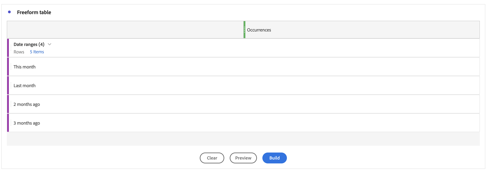

# Hoe te om de orde van het Dimension van de Waaier van de Datum in het rapport van de Werkruimte manueel te sorteren

## Beschrijving {#description}

<b>Omgeving</b>
Adobe Analytics Customer Journey Analytics

<b>Probleem</b>
U wilt de Dimensionen van de Waaier van de Datum in de orde van &quot;Deze Maand&quot; &quot;Afgelopen Maand&quot; &quot;2 maanden geleden&quot;&quot; &quot;3 maanden geleden&quot; sorteren.

Als u echter op het sorteerpictogram klikt, wordt het in andere volgorde weergegeven.
   Hoe kunt u de volgorde van het Dimension handmatig sorteren?  
            

## Resolutie {#resolution}

U kunt de Dimensionen met de eigenschap van de Bouwer van de Lijst manueel opdracht geven.

Open Tabel Vrije vorm en klik vervolgens op de knop &#39;Tabelbouwer inschakelen&#39;.

Zet Dimensionen aan de lijst in orde u wilt en de knoop van de Bouwstijl klikt

Nu worden de Dimensionen gesorteerd in de volgorde die u &quot;Deze maand&quot;&quot; &quot;Vorige maand&quot;&quot; &quot;2 maanden geleden&quot;&quot; &quot;3 maanden geleden&quot; instelt

