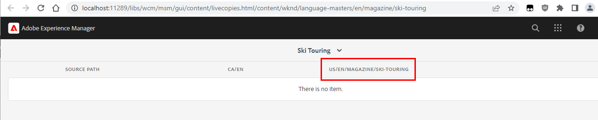

# Verwijzingen zijn niet bijgewerkt tijdens rollout voor interne Live kopie

## Beschrijving {#description}

<b>Beschrijving</b> :

Wanneer sommige geneste/binnenste live kopieën worden gemaakt, worden de verwijzingen in de inhoud van de pagina tijdens de rollout niet bijgewerkt naar het equivalent van de live kopie (ze verwijzen in plaats daarvan naar het vervagingspad).

U kunt om meerdere redenen een interne Live kopie maken:

- hetzij door ze handmatig te maken (&quot;Live kopie maken&quot;)
- of door de eigenschappen van &quot;Live Copy&quot; van een subpagina te bewerken vanuit een hoofdmap van Live Copy

Bekijk bijvoorbeeld de WKND-voorbeeldwebsite met de volgende structuur BluePrint/LiveCopy:

- Blauwdruk: /content/wknd/language-masters/nl

- Actieve kopie: /content/wknd/us/nl en/content/wknd/ca/nl

Nu, als u de Pagina-eigenschappen opent voor de pagina &quot;/content/wknd/us/nl/magazine/ski-touring&quot; (subpagina in de Live Copy &quot;/content/wknd/nl&quot;).

Als u naar het tabblad &quot;Live kopie&quot; gaat en een van de eigenschappen wijzigt (&quot;Overerving van Actieve kopie&quot;, &quot;Uitvoer overnemen vanaf bovenliggende&quot;, ...), wordt een interne live kopie gemaakt.

Dit is te zien aan de aanwezigheid/creatie van een &quot;cq:LiveSyncConfig&quot; op &quot;/content/wknd/us/en/magazine/ski-touring/jcr:content/cq:LiveSyncConfig&quot;.

Het dashboard van Actieve kopie van blauwdrukken (ga naar de BP-pagina-eigenschappen Overzicht van Actieve kopie van afdrukken) verandert ook van:

tot:

## Resolutie {#resolution}

Om verwijzingen correct te hebben die op het binnenste levende exemplaar worden herschreven, wordt het vereist om een specifieke configuratie voor de Actie van de Update MSM toe te laten om &quot;Verwijzing over genestelde LiveCopies&quot;bij te werken.

Zie de bijbehorende documentatie:

[https://experienceleague.adobe.com/docs/experience-manager-cloud-service/content/sites/administering/reusing-content/msm/live-copy-sync-config.html?lang=en#configuring-synchronization-for-updating-references](https://experienceleague.adobe.com/docs/experience-manager-cloud-service/content/sites/administering/reusing-content/msm/live-copy-sync-config.html?lang=en#configuring-synchronization-for-updating-references)

[https://experienceleague.adobe.com/docs/experience-manager-65/administering/introduction/msm-sync.html?lang=en#configuring-synchronization-for-updating-references](https://experienceleague.adobe.com/docs/experience-manager-65/administering/introduction/msm-sync.html?lang=en#configuring-synchronization-for-updating-references)

De verrichting bestaat uit of stelt een OSGi- configuratiedossier op of voert de verandering van de Console van het Web uit OSGi wanneer toepasselijk:
1. toegang tot de Configuratie OSGi van de Console van het Web (http://localhost/system/console/configMgr)
2. zoek naar de &quot;Actie van de Update van Verwijzingen CQ MSM (com.day.cq.wcm.msm.impl.actions.ReferencesUpdateActionFactory)&quot;
3. Schakel het selectievakje Referentie bijwerken in geneste LiveCopy&#39;s in
