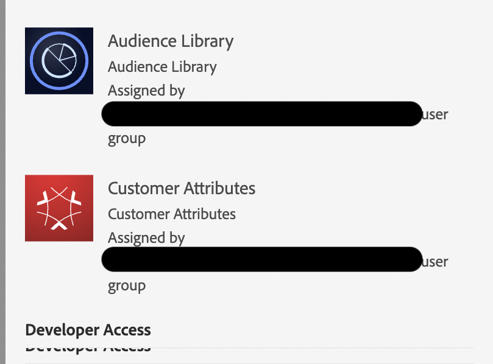

# Onverwachte AAM UI-toegang

Leer hoe u het probleem met de gebruikersinterface van Adobe Audience Manager (AAM) kunt oplossen waarbij gebruikers geen specifieke AAM hebben.

## Beschrijving {#description}

<b>Omgeving</b>

- Audience Manager
- Klantkenmerken
- Auditiebibliotheek

<b>Probleem/symptomen</b>

De gebruikers hebben toegang tot AAM UI, hoewel zij geen specifieke AAM toestemmingen hebben

## Resolutie {#resolution}

Dit is te wijten aan de rechten van Customer Attributes &amp; Audience Library:

De technologie van de Audience Manager wordt gebruikt in het achterste eind opdat de Attributen &amp; van de Audience van de Klant behoorlijk functioneren, daarom wordt een beperkte reeks AAM toestemmingen verleend samen met deze toestemmingsreeksen. Daarom als u uw gebruikers die tot UI van de AAM toegang hebben niet wilt, zult u hun toestemmingen van de Bibliotheek van het Publiek en van de Attributen van de Klant ook moeten verwijderen.
