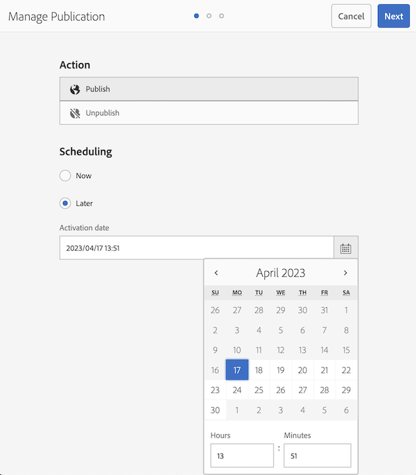

# De tijdnotatie van de activeringsdatum voor Publicatie beheren aanpassen

In het artikel wordt uitgelegd hoe u de tijdnotatie van de activeringsdatum voor Publicatie beheren in de Adobe Experience Manager kunt aanpassen. Voer de hier beschreven stappen uit.

## Beschrijving {#description}

<b>Omgeving</b>

Adobe Experience Manager (AEM) 6,5

<b>Probleem/symptomen</b>

In dit artikel wordt uitgelegd hoe u de tijdnotatie van de activeringsdatum voor Publicatie beheren kunt aanpassen.

## Resolutie {#resolution}

Maak een i18n-woordenboek voor de doeltaal. De volgende stappen passen het tijdformaat voor het Engels van 12 uur aan 24 uur aan.

<b>Stap 1.</b> Een aangepaste tijdnotatie maken in de syntaxis Moment.js (https://momentjs.com/docs/#/i18n/)

24-uursnotatie: `"2023/04/11 14:24"` `>`  `"YYYY/MM/DD HH:mm"`

<b>Stap 2.</b> Woordenboekgegevens maken met CRXDE Lite

- Een <b>i18n</b> map onder uw project (http://`<` host`>` :`<` poort`>` /apps/wknd/i18n)
- Een bestand maken <b>en.json</b> in de map i18n (http://)`<` host`>` :`<` poort`>` /apps/wknd/i18n/en.json)
- Voeg de volgende eigenschappen toe aan het bestandknooppunt:
   - Name = jcr:mixinTypes, Type = Name`[` `]` , Value = mix:language
   - Name = jcr:language, Type = String, Value = en
- Bestandsinhoud: `{ "D MMMM YYYY hh:mm a" : "YYYY/MM/DD HH:mm" }`

<b>Stap 3.</b> Open het scherm Publicatie beheren om de wijziging te controleren

De nieuwe tijdnotatie kan na enige tijd worden weerspiegeld door de browsercache.

