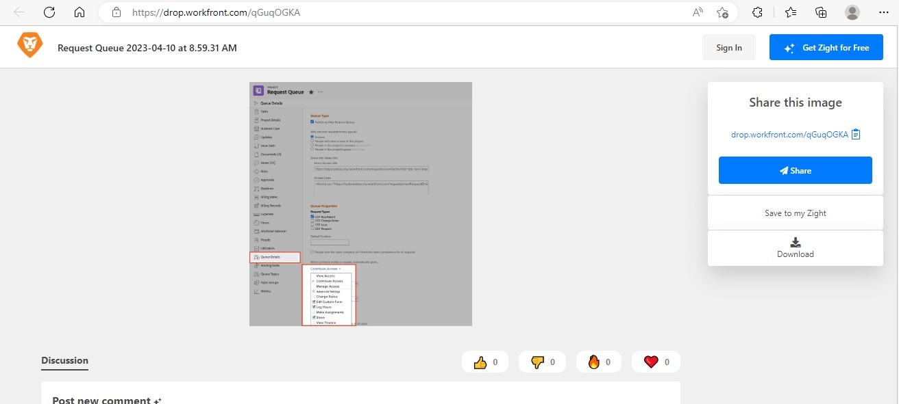

# Kan aangepaste velden niet bewerken | Workfront

## Beschrijving {#description}

<b>Omgeving</b>
Workfront

<b>Probleem/symptomen</b>
Er zijn verschillende situaties waarin een gebruiker problemen kan ondervinden bij het bewerken van aangepaste velden. Bijvoorbeeld bij het verzenden van een aanvraag, bij het bekijken van een aangepast formulier op een object of bij het weergeven van aangepaste velden in een rapport.

## Resolutie {#resolution}

<b>Stap om op te lossen:</b>
1. Zorg ervoor dat het formulier dat het veld bevat, aan het object is gekoppeld. Er wordt geprobeerd het formulier te bewerken
   1. Als een gebruiker die geen beheerder is, een formulier aan het object wil koppelen, moet hij of zij de toegang tot het object beheren om het formulier te kunnen koppelen.
2. Controleren of alle gegevens in het delen van het formulier correct zijn
   1. Open de <b>Delen</b> de instellingen voor het object waaraan het formulier is gekoppeld, vindt u hieronder:
   2. Zoek de betrokken gebruiker op de <b>Delen</b>menu
      - Als de gebruiker niet in de lijst staat, voegt u deze toe aan de <b>Delen</b> menu
   3. Zorg ervoor dat de gebruiker de <b>Contribute</b> toestemming van de <b>Aangepast formulier bewerken</b> ingeschakeld in het dialoogvenster <b>Geavanceerde instellingen, </b>zie hieronder:
   4. <b>(Deze stap is optioneel) </b>Als dit formulier deel uitmaakt van een<b> Wachtrij aanvragen, </b>Controleer de instellingen voor delen op het tabblad<b> Wachtrij aanvragen </b>ook aangepaste formulieren. Zie hieronder:

Voor meer informatie, open de volgende verbindingen:

- [Gegevens bewerken in aangepaste formuliervelden](https://experienceleague.adobe.com/docs/workfront/using/basics/work-with-custom-forms/edit-custom-forms.html?lang=en)
- [Een aanvraagwachtrij maken](https://experienceleague.adobe.com/docs/workfront/using/manage-work/requests/create-and-manage-request-queues/create-request-queue.html?lang=en)

