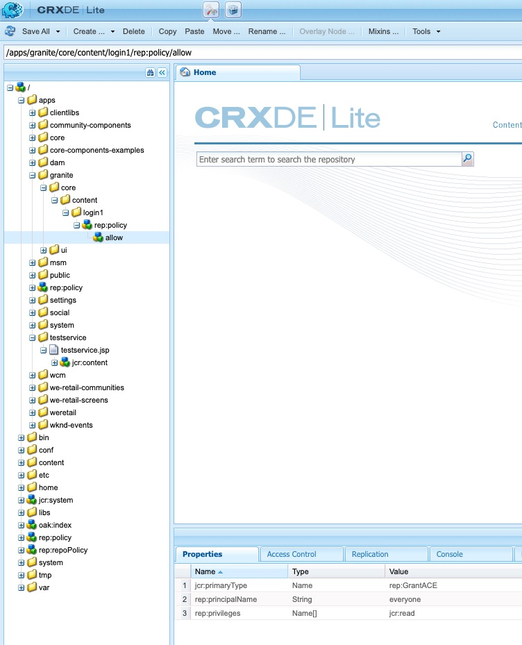

# Hoe te om aan douane login pagina in het geval van AEM OAuth stroommislukking om te leiden

Leer hoe u omleidt naar de aangepaste aanmeldingspagina in het geval van AEM OAuth-stroomfout door de gebruikers om te leiden naar de aangepaste aanmeldingspagina.

## Beschrijving {#description}

### <b>Omgeving</b>

Experience Manager

### <b>Probleem/symptomen</b>

Hoe kan ik omleiden naar de aangepaste aanmeldingspagina in een Adobe Experience Manager (AEM)-publicatieomgeving in het geval van een fout met AEM Open Authorization (OAuth)-stroom?

## Resolutie {#resolution}

In het geval van de stroom van de Prijsverhoging van de Veiligheid (SAML)/OAuth, als er een fout in de AEM authentificatiestroom is, zal het systeem aan de standaard uit-van-de-doos (OTB) AEM login pagina opnieuw richten.

Daarom is er een behoefte om de gebruikers aan de douaneSAML/OAuth IDP login pagina om te leiden. Volg de onderstaande stappen:

1. Dit knooppuntpad kopiëren */libs/graniet/core/content/login* tot */apps/granite/core/content/login1* zoals hieronder.
2. Wijzig het brontype van */apps/granite/core/content/login1* tot <b>testservice</b>, zoals hieronder weergegeven:
3. Een `rep:policy` node onder login1 met <b>onderliggend item toestaan</b>, zoals hieronder weergegeven:
4. Een <b>testservice</b> map onder <b>/apps</b> en toevoegen <b>sling:resourceType</b> with <b>testservice</b> en maak een JSP-bestand met de naam <b>testservice.jsp</b>, zoals hieronder aangegeven: (Opmerking: in het geval van OAuth-stroom, zorg er dan voor dat u het volgende toevoegt: */j_security_check?configid=`<` respectievelijk oauth - fide`>`* naar het beveiligde omleidingspad in het dialoogvenster <b>JSP</b> hieronder)
5. De config van OSGI openen <b>Adobe graniet aanmelding kiezer verificatiehandler</b> en wijzig de standaardaanmeldingspagina in */apps/granite/core/content/login1* en past de `auth.loginselector.mappings` eigenschap om te wijzen naar mijn overlay aanmeldingspagina voor uw beveiligde pad. Zie hieronder:
6. De config van OSGI openen <b>Apache Sling Authentication Service</b> en toevoegen *-/apps/graniet/core/content/login1* en *-/apps/testservice* aan de `sling.auth.requirements` lijst. Zie hieronder:
