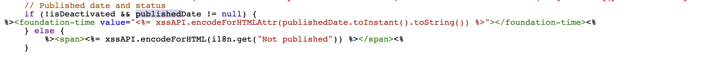

# Hoe te om het vertoningsformaat van de pagina aan te passen publiceerde datum op de console van Plaatsen?

## Beschrijving {#description}

### Omgeving

- Adobe Experience Manager (AEM) v6.5
- AEM as a Cloud Service

### Probleem/symptomen

De gepubliceerde datum van een pagina wordt zonder de tijd van de dag weergegeven in de siteconsole.

In dit artikel wordt uitgelegd hoe u de datum-/tijdnotatie van de gepubliceerde datum kunt aanpassen en de tijd van de dag kunt opnemen.

## Resolutie {#resolution}

Maak een bedekking voor elke kolom- en lijstweergave.

<b>A. Voor de kolomweergave</b>

`/libs/cq/gui/components/coral/admin/page/columnpreview/columnpreview.jsp` is bedekt.

<u>Voor</u>:

<u>Na</u>:

Toevoegen `type="datetime"` aan de `foundation-time` tag.

<b>B. Voor lijstweergaven</b>

`/libs/cq/gui/components/coral/admin/page/row/row.jsp` is bedekt.

<u>Voor</u>:

<u>Na</u>:

Toevoegen `type="datetime"` aan de `foundation-time` tag.

