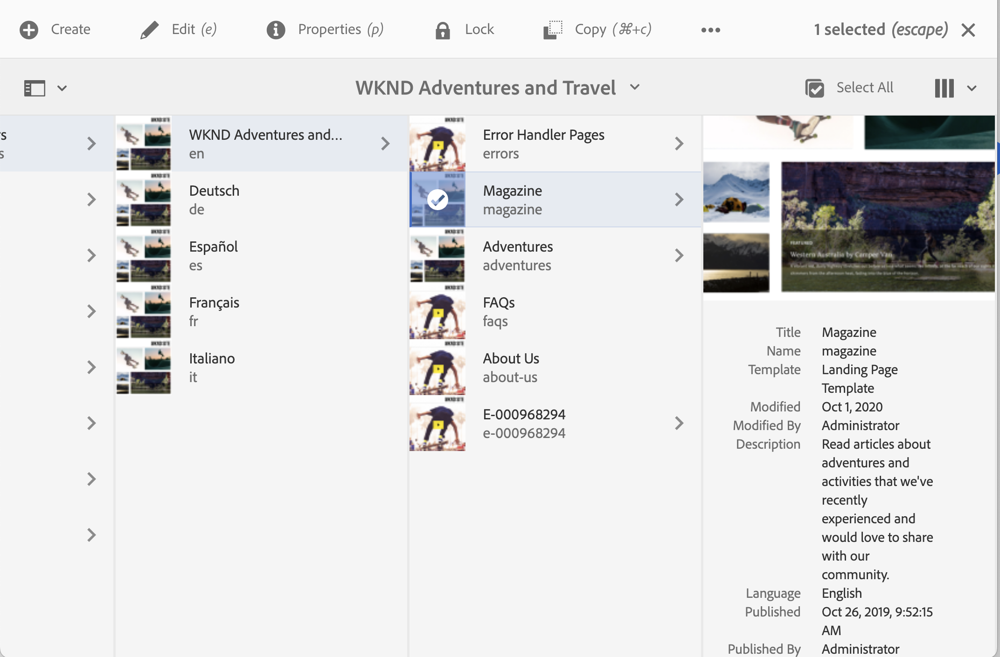

# Adobe Experience Manager: Hoe te om het vertoningsformaat van de pagina aan te passen publiceerde datum op de console van Plaatsen

## Beschrijving {#description}

AEM De pagina gepubliceerde datum wordt getoond in de plaatsenconsole, nochtans wordt de tijd van dag niet getoond.
In deze sectie wordt uitgelegd hoe u de datum-/tijdnotatie van de gepubliceerde datum kunt aanpassen en de tijd van de dag kunt opnemen.

<b>Omgevingen</b>
AEM 6.5, AEM as a Cloud Service

## Resolutie {#resolution}

Maak een bedekking voor elke kolom- en lijstweergave.

Voor de kolomweergave is /libs/cq/gui/components/coral/admin/page/columnpreview/columnpreview.jsp bedekt.
  Voor

Na: Voeg het type=&quot;datetime&quot;attribuut aan stichting-tijd markering toe.

Voor de lijstweergave is /libs/cq/gui/components/coral/admin/page/row/row.jsp bedekt.
  Voor

Na: Voeg het type=&quot;datetime&quot;attribuut aan stichting-tijd markering toe.

