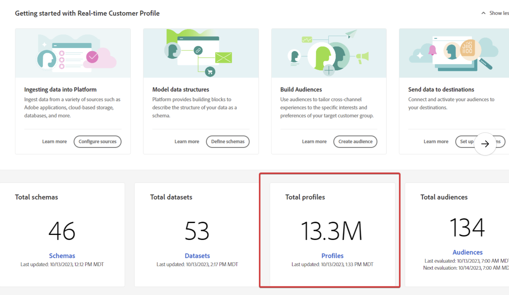

# AEP - Adresseerbaar publiek in sectie voor licentiegebruik komt niet overeen met het aantal profielen op de startpagina

Het adresseerbare publiek in de sectie van het licentiegebruik komt niet overeen met het aantal profielen van de homepage

## Beschrijving {#description}

In Experience Platform ziet u mogelijk verschillende getallen op verschillende plaatsen, zoals:           Totaal aantal profielen op startpagina:             Adresseerbaar publiek in gebruik van licentie:     

## Resolutie {#resolution}

Let op: de berekening voor adresseerbare doelgroep verschilt van het totale aantal profielen.

Het adresseerbare publiek is welk profiel in zijn winkel heeft <u>ongeacht</u> van om het even welk samenvoegbeleid terwijl wat wij in om het even welk dashboard (zoals het Totale profielvakje op de Homepage) tonen het profiel is dat op het standaardsamenvoegbeleid wordt gebaseerd.
