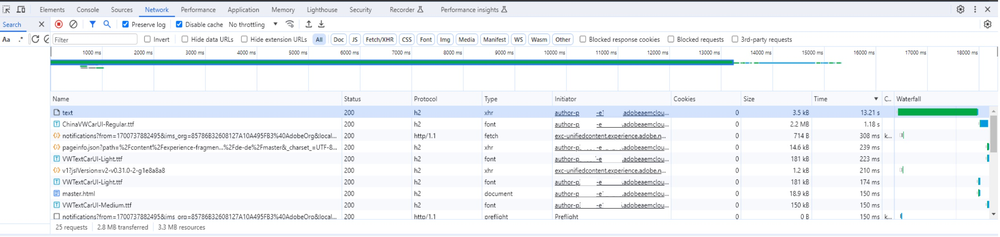

# Prestatieproblemen tijdens het bewerken van inhoud

Omgeving: AEM as a Cloud Service

Versie: AEM SDK v2023.8.13206 of ouder

## Beschrijving {#description}

Klanten met een AEM SDK-versie die ouder is dan versie 2023.9.13665 kunnen prestatieproblemen ondervinden bij het bewerken van pagina&#39;s.  
 Op een nieuw en leeg ervaringsfragment duurt het toevoegen van één tekstcomponent soms maximaal 15 seconden totdat de pagina opnieuw bruikbaar is.
 De pagina reageert niet meer, wacht ergens op en verfrist zich op een bepaald punt.

## Resolutie {#resolution}

<b>Problemen oplossen:</b>

In de browser ontwikkelaarsconsole, verifieer welk het meest tijdrovende verzoek is en controleer het verzoek URL.

In het bovenstaande voorbeeld:

Zoek in het foutenlogboek van de auteur naar de weg in het verzoek URL - bv. /content/experience-fragments/path/to/experience/fragment/_jcr_content/root/container/text

<b>Resolutie:</b>

Na controle van de stammen kan worden vastgesteld dat de oorzaak van de vertraging `[` 1`]` . De ProcessorUtils wacht tot de taak zich in de index bevindt. Dit kan enige tijd in beslag nemen, afhankelijk van de status van de opslagruimten. De minimale wachttijd is gemiddeld 5 tot 7 seconden en de tijd die nodig is om de taak uit te voeren.

Dit is een bekend probleem dat is bijgehouden in de interne Jiras-SITES-14804 en GRANITE-45493. Niettemin is een oplossing geïmplementeerd en opgenomen in Oak versie 1.54 - `[` 2`]` .

Oak 1.54 is opgenomen in AEM SDK-versie 2023.9.13665.

Daarom moet de omgeving waarin dit probleem zich voordoet, worden geüpgraded naar een versie die gelijk is aan of hoger is dan 2023.9.13665 om dit gedrag te beperken.

`[` 1`]`

`author    aemerror    23.11.2023 11:12:44.432    WARN    [  [ 1700737951330]  POST /content/experience-fragments/path/to/experience/fragment/_jcr_content/root/container/text HTTP/1.1]  com.adobe.cq.updateprocessor.impl.ProcessorUtils Deferred job availability; took 13011ms to become available through index.`

`[` 2`]`

[https://issues.apache.org/jira/browse/OAK-10265](https://issues.apache.org/jira/browse/OAK-10265)
