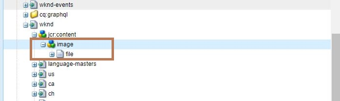

# Adobe Experience Manager: De bestaande miniatuur van een pagina verwijderen

In dit artikel wordt een methode geïntroduceerd waarmee de standaardinstelling van de miniatuur wordt hersteld.

## Beschrijving {#description}

### <b>Omgeving</b>

- Adobe Experience Manager as a Cloud Service
- Adobe Experience Manager 6.5

### Probleem/symptomen

Hoewel het mogelijk is om een miniatuur te wijzigen die op een pagina is ingesteld, is er geen directe optie om de standaardminiatuur te herstellen.

## Resolutie {#resolution}

Verwijder het knooppunt /jcr:content/image onder het paginapad om dit probleem op te lossen. Als u bijvoorbeeld het knooppunt /content/wknd/jcr:content/image in CRXDE Lite verwijdert, wordt de standaardminiatuur voor de startpagina van de WKND-site gebruikt.

